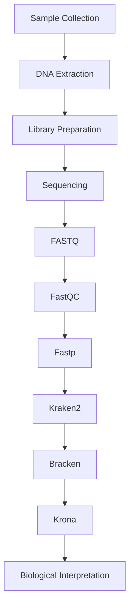

# 🦠 Metagenomics

> [!NOTE]
> **Module 2 • Lesson 5**
>
> Learn how NGS is used to study entire microbial communities directly from environmental or clinical samples.

---

# 🎯 Learning Objectives

After this lesson, you will be able to:

- Explain Metagenomics
- Differentiate 16S and Shotgun Metagenomics
- Understand the workflow
- Create a Linux environment
- Install required tools
- Run a basic taxonomic analysis
- Answer interview questions confidently

---

# 📌 What is Metagenomics?

**Metagenomics** is the study of genetic material (DNA or RNA) recovered directly from environmental or clinical samples without culturing microorganisms.

Unlike traditional microbiology, metagenomics allows us to identify all microorganisms present in a sample simultaneously.

---

# ❓ Why Do We Need Metagenomics?

Many microorganisms:

- Cannot be cultured
- Grow very slowly
- Require special laboratory conditions

Metagenomics solves these problems by sequencing DNA directly from the sample.

---

# 📊 Metagenomics at a Glance

| Feature | Description |
|---------|-------------|
| Material | Mixed microbial DNA |
| Sequencing | 16S or Shotgun |
| Cost | Moderate to High |
| Data Size | Large |
| Main Goal | Identify microorganisms & their functions |

---

# 🧪 Sample Types

Common samples include:

- 💩 Stool
- 🌱 Soil
- 💧 Water
- 🩸 Blood
- 🦷 Oral swab
- 🌊 Marine water
- 🏥 Clinical specimens

---

# 🔬 Types of Metagenomics

## 1️⃣ 16S rRNA Sequencing

✔ Targets only bacterial 16S rRNA genes.

**Advantages**

- Low cost
- Simple analysis
- Good for bacterial diversity

**Limitations**

- Cannot detect viruses
- Limited fungal detection
- No functional gene analysis

---

## 2️⃣ Shotgun Metagenomics

✔ Sequences all DNA present in the sample.

Can identify:

- Bacteria
- Viruses
- Fungi
- Archaea
- Parasites

and their functional genes.

---

# 🆚 16S vs Shotgun

| Feature | 16S | Shotgun |
|---------|------|----------|
| Bacteria | ✅ | ✅ |
| Viruses | ❌ | ✅ |
| Fungi | Limited | ✅ |
| Functional Genes | ❌ | ✅ |
| Species Resolution | Moderate | High |
| Cost | Low | Higher |

---

# 🔄 Workflow



---

# 🐧 Linux Environment

## Create Environment

```bash
conda create -n metagenomics python=3.11 -y
```

Activate

```bash
conda activate metagenomics
```

---

# 📦 Install Software

```bash
mamba install \
fastqc \
multiqc \
fastp \
kraken2 \
bracken \
krona \
seqkit
```

---

# ✅ Verify Installation

```bash
fastqc --version

kraken2 --version

bracken -v

ktImportTaxonomy
```

---

# 📂 Project Structure

```text
Metagenomics_Project/

├── raw_data/
├── qc/
├── trimmed/
├── database/
├── kraken/
├── bracken/
├── krona/
├── results/
├── scripts/
└── logs/
```

---

# 💻 Pipeline

## Step 1 – Quality Check

```bash
fastqc sample.fastq.gz
```

---

## Step 2 – Trimming

```bash
fastp \
-i sample.fastq.gz \
-o clean.fastq.gz
```

---

## Step 3 – Taxonomic Classification

```bash
kraken2 \
--db database \
clean.fastq.gz \
--report report.txt \
--output output.txt
```

---

## Step 4 – Species Abundance

```bash
bracken \
-d database \
-i report.txt \
-o abundance.txt
```

---

## Step 5 – Interactive Visualization

```bash
ktImportTaxonomy output.txt
```

---

# 📂 Input Files

| File | Purpose |
|------|---------|
| FASTQ | Raw reads |
| Kraken Database | Reference database |

---

# 📂 Output Files

| File | Purpose |
|------|---------|
| report.txt | Taxonomic summary |
| output.txt | Read classifications |
| abundance.txt | Species abundance |
| Krona HTML | Interactive visualization |

---

# 🏥 Applications

- Human Gut Microbiome
- Cancer Biomarker Discovery
- Infectious Disease Detection
- Environmental Microbiology
- Food Safety
- Agriculture
- Wastewater Surveillance

---

# ⚠️ Common Mistakes

> [!WARNING]
>
> - Using the wrong Kraken database.
> - Forgetting to trim low-quality reads.
> - Host DNA contamination.
> - Running out of RAM during classification.

---

# 🧠 Interview Corner

### ❓ What is Metagenomics?

> Sequencing all genetic material present in a mixed microbial sample without culturing organisms.

---

### ❓ Difference between 16S and Shotgun Metagenomics?

| 16S | Shotgun |
|------|----------|
| Only bacteria | All organisms |
| Cheap | More expensive |
| Taxonomy | Taxonomy + Function |

---

### ❓ Why is Kraken2 popular?

Because it performs very fast taxonomic classification using k-mer matching.

---

# 📝 Lesson Summary

- Metagenomics studies microbial communities directly.
- 16S sequencing targets bacteria.
- Shotgun sequencing analyzes all DNA.
- Kraken2 and Bracken are widely used for taxonomic analysis.
- Krona provides interactive visualization.

---

# 📚 References

- Illumina Learning Center
- NHGRI
- Kraken2 Documentation
- Bracken Documentation
- Nature Reviews Microbiology

---

# ➡️ Next Lesson

**Small RNA Sequencing**
