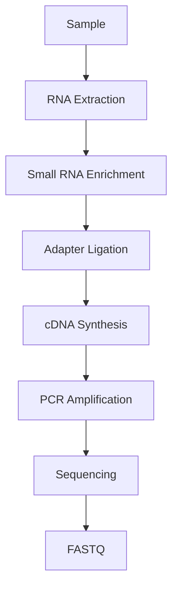
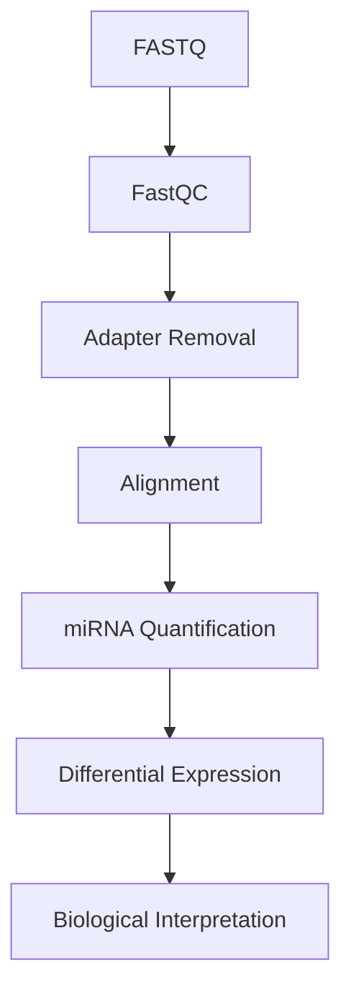

# 🧬 Small RNA Sequencing (Small RNA-Seq)

> [!NOTE]
> **Module 2 • Lesson 6**
>
> Learn how small regulatory RNAs such as microRNAs (miRNAs), siRNAs, and piRNAs are identified and quantified using Next-Generation Sequencing.

---

# 🎯 Learning Objectives

After completing this lesson, you will be able to:

- Explain Small RNA Sequencing
- Differentiate mRNA and small RNA sequencing
- Understand the complete workflow
- Create a Linux environment
- Install required software
- Analyze small RNA sequencing data
- Answer interview questions confidently

---

# 📚 Prerequisites

Before starting this lesson, you should know:

- RNA Basics
- RNA-Seq
- FASTQ Format
- Quality Control

---

# 💡 Real-Life Analogy

Imagine a company.

The employees perform the work.

The managers control what employees do.

In a cell:

- mRNA = Employees (carry genetic instructions)
- miRNA = Managers (control gene expression)

Small RNA sequencing studies these "managers."

---

# 📌 What is Small RNA Sequencing?

Small RNA Sequencing is an NGS method used to identify and quantify short RNA molecules, typically **18–35 nucleotides** long.

These RNAs regulate gene expression and play important roles in development, cancer, immunity, and many diseases.

---

# 🧬 Types of Small RNAs

| RNA | Length | Function |
|------|---------|----------|
| miRNA | ~21–23 nt | Gene regulation |
| siRNA | ~20–25 nt | RNA interference |
| piRNA | ~24–31 nt | Transposon silencing |
| snoRNA | 60–300 nt | rRNA modification |
| snRNA | ~150 nt | RNA splicing |

---

# ❓ Why Do We Perform Small RNA-Seq?

It helps answer questions like:

- Which miRNAs are expressed?
- Which miRNAs are differentially expressed?
- Which regulatory RNAs are associated with disease?
- How do miRNAs regulate gene expression?

---

# 📊 Small RNA-Seq at a Glance

| Feature | Description |
|---------|-------------|
| Material | Small RNA molecules |
| Read Length | 50–75 bp |
| Main Goal | Regulatory RNA profiling |
| Cost | Moderate |
| Applications | Cancer, Biomarkers, Gene Regulation |

---

# 🔬 Wet Lab Workflow



---

# 💻 Bioinformatics Workflow



---

# 🐧 Linux Environment

## Create Environment

```bash
conda create -n smallrna python=3.11 -y
```

Activate

```bash
conda activate smallrna
```

---

# 📦 Install Software

```bash
mamba install \
fastqc \
multiqc \
cutadapt \
bowtie \
samtools
```

---

# ✅ Verify Installation

```bash
fastqc --version

cutadapt --version

bowtie --version

samtools --version
```

---

# 📁 Project Structure

```text
SmallRNA_Project/

├── raw_data/
├── qc/
├── trimmed/
├── reference/
├── alignment/
├── counts/
├── results/
├── scripts/
└── logs/
```

---

# 💻 Pipeline

## Step 1 – Quality Check

```bash
fastqc sample.fastq.gz
```

---

## Step 2 – Adapter Removal

```bash
cutadapt \
-a TGGAATTCTCGG \
-o trimmed.fastq.gz \
sample.fastq.gz
```

---

## Step 3 – Alignment

```bash
bowtie \
reference \
trimmed.fastq.gz \
alignment.sam
```

---

## Step 4 – Convert to BAM

```bash
samtools view -Sb alignment.sam > alignment.bam
```

---

# 📂 Input Files

| File | Purpose |
|------|---------|
| FASTQ | Raw sequencing reads |
| miRNA Reference | Known miRNA sequences |

---

# 📂 Output Files

| File | Purpose |
|------|---------|
| FASTQ | Raw reads |
| Trimmed FASTQ | Adapter-free reads |
| BAM | Aligned reads |
| Counts | miRNA expression |
| DEG List | Differentially expressed miRNAs |

---

# 🏥 Applications

- Cancer Biomarkers
- Neurological Disorders
- Cardiovascular Diseases
- Viral Infections
- Developmental Biology

---

# ⚠️ Common Mistakes

> [!WARNING]
>
> - Forgetting adapter trimming (critical for short reads)
> - Using the wrong reference database
> - Poor RNA quality
> - Ignoring read length distribution

---

# 🧠 Interview Corner

### ❓ What is the difference between RNA-Seq and Small RNA-Seq?

> RNA-Seq measures mRNA and the transcriptome, while Small RNA-Seq specifically targets short regulatory RNAs such as miRNAs, siRNAs, and piRNAs.

---

### ❓ Why is adapter trimming especially important?

> Because small RNA inserts are very short, sequencing often reads into the adapter sequence. Removing adapters is essential before alignment.

---

### ❓ Which aligner is commonly used?

> Bowtie is commonly used because it efficiently aligns short sequencing reads.

---

# 📝 Lesson Summary

- Small RNA-Seq studies regulatory RNAs.
- miRNAs regulate gene expression.
- Adapter trimming is a critical preprocessing step.
- Bowtie is commonly used for alignment.
- Small RNA-Seq is widely used for biomarker discovery.

---

# 📚 References

- miRBase
- Illumina Learning Center
- Nature Reviews Genetics
- FastQC Documentation
- Cutadapt Documentation

---

# ➡️ Next Lesson

**Single-Cell RNA Sequencing (scRNA-Seq)**
