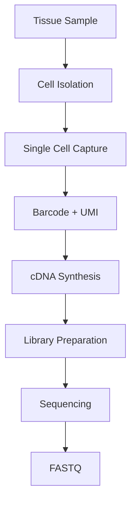
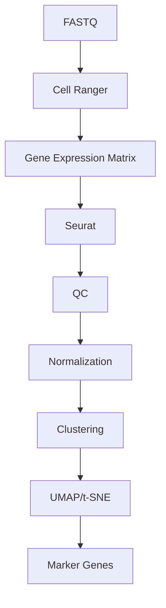

# 🧫 Single-Cell RNA Sequencing (scRNA-Seq)

> [!NOTE]
> **Module 2 • Lesson 7**
>
> Learn how gene expression is measured at the level of individual cells instead of averaging signals from an entire tissue.

---

# 🎯 Learning Objectives

After completing this lesson, you will be able to:

- Explain Single-Cell RNA Sequencing
- Understand why scRNA-Seq is different from bulk RNA-Seq
- Learn about cell barcodes and UMIs
- Understand the complete workflow
- Create a Linux environment
- Run a basic Cell Ranger pipeline
- Understand downstream analysis using Seurat

---

# 📚 Prerequisites

Before this lesson you should know:

- RNA
- RNA-Seq
- Gene Expression
- FASTQ
- Linux Basics

---

# 💡 Real-Life Analogy

Imagine a classroom with 100 students.

Bulk RNA-Seq asks:

> "What is the average score of the class?"

Single-cell RNA-Seq asks:

> "What is the score of each individual student?"

Instead of averaging thousands of cells together, scRNA-Seq studies every cell separately.

---

# 📌 What is Single-Cell RNA Sequencing?

Single-cell RNA sequencing (scRNA-Seq) is an NGS technique that measures gene expression in **individual cells**, allowing researchers to identify different cell types, cell states, and rare cell populations.

---

# ❓ Why Do We Need scRNA-Seq?

Bulk RNA-Seq combines RNA from many cells, producing an average expression profile.

This can hide important biological differences.

scRNA-Seq helps us:

- Identify different cell types
- Discover rare cells
- Study tumor heterogeneity
- Understand immune responses
- Investigate developmental processes

---

# 📊 scRNA-Seq at a Glance

| Feature | Description |
|---------|-------------|
| Sample | Individual Cells |
| Main Goal | Cell-specific gene expression |
| Output | Expression matrix |
| Popular Platform | 10x Genomics Chromium |

---

# 🔑 Key Concepts

## Cell Barcode

A unique DNA sequence added to each cell.

It identifies which reads came from which cell.

---

## UMI (Unique Molecular Identifier)

A short random sequence attached to each RNA molecule.

It helps remove PCR duplicates and improves quantification accuracy.

---

# 🔬 Wet Lab Workflow



---

# 💻 Bioinformatics Workflow



---

# 🐧 Linux Environment

## Create Environment

```bash
conda create -n scrnaseq python=3.11 -y
```

Activate

```bash
conda activate scrnaseq
```

---

# 📦 Install Software

```bash
mamba install \
fastqc \
samtools \
star
```

> [!IMPORTANT]
> Cell Ranger is distributed by **10x Genomics** and is typically installed separately by downloading it from the official website rather than through Conda.

---

# 📁 Project Structure

```text
scRNASeq_Project/

├── raw_data/
├── reference/
├── fastq/
├── cellranger/
├── matrices/
├── seurat/
├── results/
├── scripts/
└── logs/
```

---

# 💻 Pipeline

## Step 1 – Quality Check

```bash
fastqc sample.fastq.gz
```

---

## Step 2 – Generate FASTQ (if starting from BCL)

```bash
cellranger mkfastq
```

---

## Step 3 – Gene Counting

```bash
cellranger count \
--id=sample1 \
--transcriptome=reference \
--fastqs=fastq/
```

---

## Step 4 – Downstream Analysis

Usually performed in **R using Seurat**.

Common analyses include:

- Quality Control
- Normalization
- Cell Clustering
- UMAP
- Differential Expression
- Marker Gene Identification

---

# 📂 Input Files

| File | Description |
|------|-------------|
| FASTQ | Raw Reads |
| Reference Genome | STAR Index |
| GTF | Gene Annotation |

---

# 📂 Output Files

| File | Description |
|------|-------------|
| Expression Matrix | Gene Counts |
| Cell Metadata | Cell Information |
| UMAP Plot | Cell Clusters |
| Marker Gene Table | Cluster Markers |

---

# 🏥 Applications

- Cancer Research
- Immunology
- Developmental Biology
- Neuroscience
- Stem Cell Research
- Tumor Microenvironment

---

# ⚠️ Common Mistakes

> [!WARNING]
>
> - Poor cell viability before sequencing
> - Doublets (two cells captured together)
> - Low sequencing depth
> - High mitochondrial RNA percentage
> - Incorrect filtering of low-quality cells

---

# 🧠 Interview Corner

### ❓ What is the main difference between bulk RNA-Seq and scRNA-Seq?

Bulk RNA-Seq measures the average gene expression across many cells, while scRNA-Seq measures gene expression in individual cells.

---

### ❓ What is a Cell Barcode?

A unique sequence that identifies which sequencing reads belong to a particular cell.

---

### ❓ What is a UMI?

A Unique Molecular Identifier used to distinguish original RNA molecules from PCR duplicates.

---

### ❓ Which software is commonly used?

- Cell Ranger
- Seurat
- Scanpy

---

# 📝 Lesson Summary

- scRNA-Seq measures gene expression in individual cells.
- Cell barcodes identify cells.
- UMIs reduce PCR bias.
- Cell Ranger processes raw sequencing data.
- Seurat and Scanpy are popular downstream analysis tools.

---

# 📚 References

- 10x Genomics Documentation
- Seurat Documentation
- Scanpy Documentation
- Nature Methods
- Nature Biotechnology

---

# ➡️ Next Lesson

**Spatial Transcriptomics**
