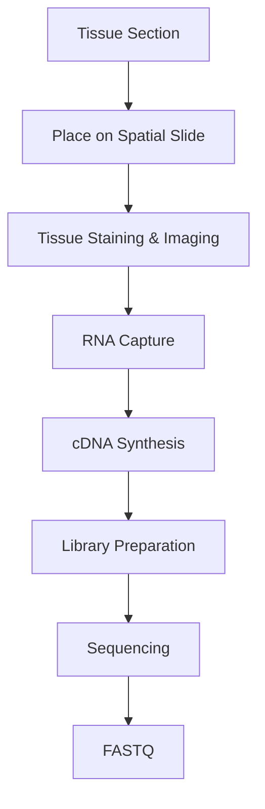
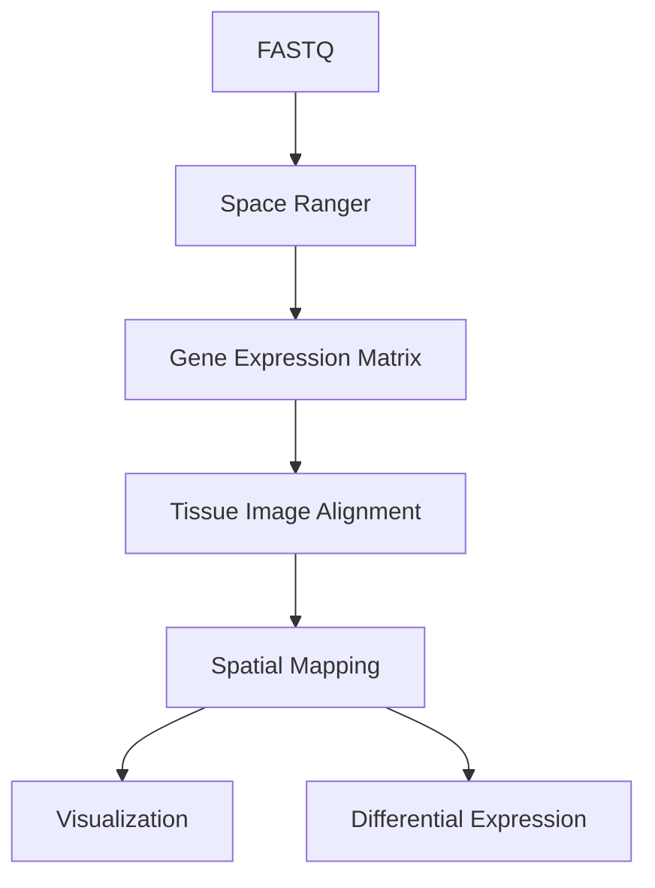

# 🗺️ Spatial Transcriptomics

> [!NOTE]
> **Module 2 • Lesson 8**
>
> Learn how Spatial Transcriptomics combines gene expression data with tissue location, allowing researchers to understand where genes are expressed within a tissue.

---

# 🎯 Learning Objectives

After completing this lesson, you will be able to:

- Explain Spatial Transcriptomics
- Differentiate Spatial Transcriptomics from RNA-Seq and scRNA-Seq
- Understand the complete workflow
- Create a Linux environment
- Install commonly used software
- Understand the analysis pipeline
- Explain Spatial Transcriptomics in interviews

---

# 📚 Prerequisites

Before this lesson, you should know:

- RNA
- RNA-Seq
- Single-Cell RNA-Seq
- Gene Expression
- FASTQ
- Linux Basics

---

# 💡 Real-Life Analogy

Imagine you have a **city map**.

You know **where** every school, hospital, and park is located.

Now imagine someone only gives you a **list of buildings**, but without their locations.

Which information is more useful?

👉 The city map.

Spatial Transcriptomics works the same way.

Traditional RNA-Seq tells **which genes are expressed**.

Spatial Transcriptomics tells:

- Which genes are expressed
- **Where they are expressed inside the tissue**

---

# 📌 What is Spatial Transcriptomics?

Spatial Transcriptomics is an NGS-based technology that measures gene expression while preserving the spatial location of RNA molecules within a tissue section.

Unlike bulk RNA-Seq or scRNA-Seq, Spatial Transcriptomics links gene expression with tissue architecture.

---

# ❓ Why Do We Need Spatial Transcriptomics?

Traditional RNA-Seq loses positional information after tissue dissociation.

Spatial Transcriptomics helps researchers answer questions such as:

- Where is a gene expressed?
- Which cells interact with neighboring cells?
- How are tumors organized?
- Where are immune cells located?
- Which regions are diseased?

---

# 📊 Spatial Transcriptomics at a Glance

| Feature | Description |
|---------|-------------|
| Sample | Tissue Section |
| Sequencing | RNA |
| Main Goal | Gene Expression + Spatial Location |
| Popular Platform | 10x Genomics Visium |

---

# 🔬 Wet Lab Workflow



---

# 💻 Bioinformatics Workflow



---

# 🐧 Linux Environment

## Create Environment

```bash
conda create -n spatial python=3.11 -y
```

Activate

```bash
conda activate spatial
```

---

# 📦 Install Software

```bash
mamba install \
fastqc \
samtools \
star
```

> [!IMPORTANT]
> **Space Ranger** is provided by **10x Genomics** and is installed separately from the official website.

---

# 📁 Project Structure

```text
Spatial_Project/

├── raw_data/
├── images/
├── fastq/
├── reference/
├── spaceranger/
├── results/
├── scripts/
└── logs/
```

---

# 💻 Pipeline

## Step 1 – Quality Check

```bash
fastqc sample.fastq.gz
```

---

## Step 2 – Spatial Gene Counting

```bash
spaceranger count \
--id=sample1 \
--transcriptome=reference \
--fastqs=fastq \
--image=tissue.jpg
```

---

## Step 3 – Downstream Analysis

Common tools:

- Seurat
- Giotto
- Scanpy
- Squidpy

---

# 📂 Input Files

| File | Description |
|------|-------------|
| FASTQ | Raw sequencing reads |
| Tissue Image | Histology image |
| Reference Genome | FASTA |
| Gene Annotation | GTF |

---

# 📂 Output Files

| File | Description |
|------|-------------|
| Expression Matrix | Gene Counts |
| Tissue Image | Registered Image |
| Spatial Coordinates | Spot Locations |
| Cluster Maps | Tissue Regions |

---

# 🏥 Applications

- Cancer Biology
- Tumor Microenvironment
- Neuroscience
- Developmental Biology
- Immunology
- Pathology

---

# ⚠️ Common Mistakes

> [!WARNING]
>
> - Poor tissue quality
> - Incorrect image alignment
> - Low RNA integrity
> - Poor spot detection

---

# 🧠 Interview Corner

### ❓ What is the difference between RNA-Seq, scRNA-Seq, and Spatial Transcriptomics?

| Method | Information |
|---------|-------------|
| RNA-Seq | Average gene expression |
| scRNA-Seq | Gene expression of individual cells |
| Spatial Transcriptomics | Gene expression + tissue location |

---

### ❓ Why is Spatial Transcriptomics important?

Because it preserves the spatial organization of tissues, allowing researchers to study how gene expression relates to tissue structure and cell interactions.

---

### ❓ Which software is commonly used?

- Space Ranger
- Seurat
- Giotto
- Squidpy

---

# 📝 Lesson Summary

- Spatial Transcriptomics measures gene expression while preserving tissue location.
- It combines sequencing data with histological images.
- It is widely used in cancer and neuroscience research.
- Space Ranger is the standard preprocessing tool for 10x Genomics Visium data.

---

# 📚 References

- 10x Genomics Visium Documentation
- Space Ranger Documentation
- Nature Biotechnology
- Seurat Documentation
- Giotto Documentation

---

# ➡️ Next Lesson

**DNA Methylation Sequencing**
