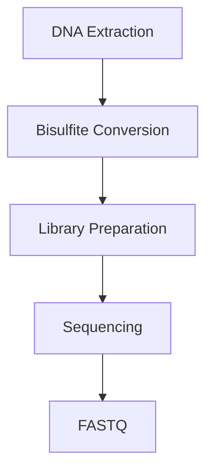
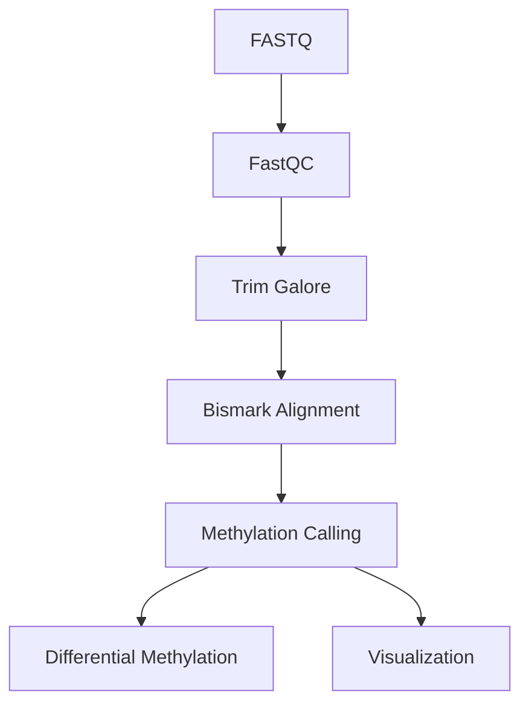

# 🧬 DNA Methylation Sequencing

> [!NOTE]
> **Module 2 • Lesson 9**
>
> Learn how DNA methylation is measured using Next-Generation Sequencing to study epigenetic regulation, gene silencing, and disease mechanisms.

---

# 🎯 Learning Objectives

After completing this lesson, you will be able to:

- Explain DNA methylation.
- Understand the role of epigenetics.
- Learn different DNA methylation sequencing methods.
- Create a Linux environment.
- Install required software.
- Understand the bioinformatics workflow.
- Answer interview questions confidently.

---

# 📚 Prerequisites

Before this lesson, you should know:

- DNA Structure
- Gene Expression
- Genome
- NGS Basics

---

# 💡 Real-Life Analogy

Imagine every gene is a **light bulb**.

DNA is the electrical wiring.

DNA methylation acts like a **switch**.

- Switch ON → Gene can be expressed.
- Switch OFF → Gene expression is reduced or silenced.

DNA methylation controls gene activity **without changing the DNA sequence**.

---

# 📌 What is DNA Methylation?

DNA methylation is an **epigenetic modification** in which a **methyl group (–CH₃)** is added to cytosine bases, most commonly at **CpG sites**.

This modification can regulate gene expression without altering the DNA sequence.

---

# ❓ Why Study DNA Methylation?

DNA methylation plays an important role in:

- Gene regulation
- Embryonic development
- Cell differentiation
- Genomic imprinting
- X-chromosome inactivation
- Cancer
- Aging

---

# 📊 DNA Methylation at a Glance

| Feature | Description |
|---------|-------------|
| Molecule | DNA |
| Target | CpG Cytosines |
| Main Goal | Epigenetic Analysis |
| Common Technology | Bisulfite Sequencing |

---

# 🧬 Common DNA Methylation Methods

| Method | Description |
|---------|-------------|
| WGBS | Whole Genome Bisulfite Sequencing |
| RRBS | Reduced Representation Bisulfite Sequencing |
| Targeted Bisulfite Sequencing | Selected genomic regions |
| Nanopore Methylation | Direct methylation detection without bisulfite conversion |

---

# 🔬 Wet Lab Workflow



---

# 💻 Bioinformatics Workflow



---

# 🐧 Linux Environment

## Create Environment

```bash
conda create -n methylation python=3.11 -y
```

Activate

```bash
conda activate methylation
```

---

# 📦 Install Software

```bash
mamba install \
fastqc \
multiqc \
trim-galore \
bismark \
samtools
```

---

# ✅ Verify Installation

```bash
fastqc --version

trim_galore --version

bismark --version

samtools --version
```

---

# 📁 Project Structure

```text
DNA_Methylation_Project/

├── raw_data/
├── qc/
├── trimmed/
├── reference/
├── alignment/
├── methylation/
├── results/
├── scripts/
└── logs/
```

---

# 💻 Pipeline

## Step 1 – Quality Check

```bash
fastqc sample.fastq.gz
```

---

## Step 2 – Adapter & Quality Trimming

```bash
trim_galore sample.fastq.gz
```

---

## Step 3 – Genome Preparation

```bash
bismark_genome_preparation reference/
```

---

## Step 4 – Alignment

```bash
bismark reference/ sample.fastq.gz
```

---

## Step 5 – Extract Methylation

```bash
bismark_methylation_extractor sample.bam
```

---

# 📂 Input Files

| File | Purpose |
|------|---------|
| FASTQ | Raw sequencing reads |
| Reference Genome | FASTA |
| Annotation | GTF/GFF |

---

# 📂 Output Files

| File | Purpose |
|------|---------|
| BAM | Aligned reads |
| Methylation Report | CpG methylation calls |
| Coverage File | Methylation percentages |

---

# 🏥 Applications

- Cancer Epigenetics
- Biomarker Discovery
- Aging Research
- Developmental Biology
- Neurobiology
- Precision Medicine

---

# ⚠️ Common Mistakes

> [!WARNING]
>
> - Poor bisulfite conversion efficiency.
> - Low sequencing depth.
> - Incorrect reference genome preparation.
> - Ignoring quality control before alignment.

---

# 🧠 Interview Corner

### ❓ What is DNA methylation?

DNA methylation is the addition of a methyl group to DNA, usually at CpG sites, which can regulate gene expression without changing the DNA sequence.

---

### ❓ What is bisulfite sequencing?

Bisulfite sequencing converts unmethylated cytosines to uracil (read as thymine after PCR), while methylated cytosines remain unchanged. This allows methylation status to be determined by sequencing.

---

### ❓ Why is Bismark widely used?

Because it is specifically designed to align bisulfite-treated sequencing reads and accurately determine DNA methylation patterns.

---

# 📝 Lesson Summary

- DNA methylation is an epigenetic modification.
- It regulates gene expression without altering DNA sequence.
- WGBS and RRBS are common sequencing approaches.
- Bismark is the standard tool for bisulfite sequencing analysis.
- DNA methylation is widely studied in cancer and epigenetics.

---

# 📥 Recommended Practice Dataset

| Source | Dataset |
|---------|----------|
| GEO | Search for WGBS breast cancer datasets |
| SRA | Public bisulfite sequencing datasets |
| ENCODE | DNA methylation data |

---

# 📚 References

- Bismark Documentation
- ENCODE Project
- Nature Reviews Genetics
- Illumina DNA Methylation Resources

---

# ➡️ Next Lesson

**ChIP-Seq**
