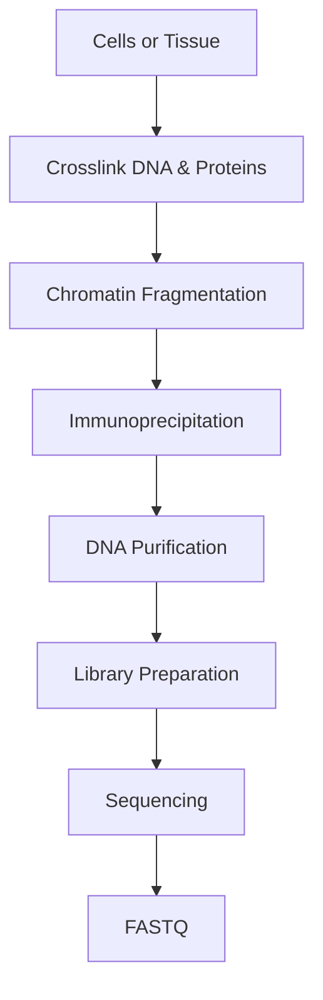
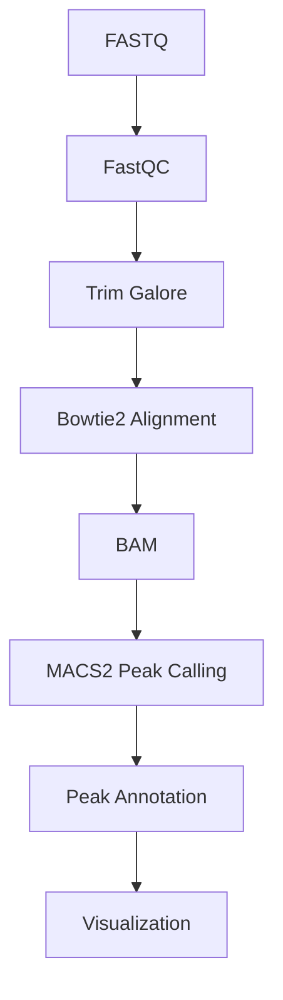

# 🧬 ChIP-Seq (Chromatin Immunoprecipitation Sequencing)

> [!NOTE]
> **Module 2 • Lesson 10**
>
> Learn how ChIP-Seq is used to identify DNA regions bound by transcription factors and histone proteins across the genome.

---

# 🎯 Learning Objectives

After completing this lesson, you will be able to:

- Explain ChIP-Seq.
- Understand Chromatin Immunoprecipitation (ChIP).
- Identify transcription factor binding sites.
- Study histone modifications.
- Create a Linux environment.
- Install ChIP-Seq analysis tools.
- Perform peak calling.
- Answer interview questions confidently.

---

# 📚 Prerequisites

Before this lesson you should know:

- DNA Structure
- Gene Expression
- Epigenetics
- DNA Methylation
- NGS Basics

---

# 💡 Real-Life Analogy

Imagine a huge library.

Many researchers place sticky notes on important pages.

Instead of reading every page,

you only want to know

**where the sticky notes are located.**

Those sticky notes represent

- Transcription Factors
- Histone Proteins

ChIP-Seq identifies the exact DNA regions where these proteins bind.

---

# 📌 What is ChIP-Seq?

Chromatin Immunoprecipitation Sequencing (ChIP-Seq) is an NGS technique used to identify DNA regions bound by proteins such as:

- Transcription Factors
- Histones
- Chromatin-associated proteins

It combines Chromatin Immunoprecipitation (ChIP) with Next-Generation Sequencing.

---

# ❓ Why Perform ChIP-Seq?

ChIP-Seq helps answer questions like:

- Which genes are regulated by a transcription factor?
- Where do transcription factors bind?
- Which histone modifications are present?
- Which genomic regions are active or inactive?

---

# 📊 ChIP-Seq at a Glance

| Feature | Description |
|---------|-------------|
| Molecule | DNA |
| Target | DNA-bound proteins |
| Main Goal | Protein-DNA interaction mapping |
| Common Analysis | Peak Calling |

---

# 🧬 Common Targets

## Transcription Factors

Examples:

- p53
- CTCF
- MYC
- NF-κB

---

## Histone Modifications

| Modification | Meaning |
|--------------|---------|
| H3K4me3 | Active promoters |
| H3K27ac | Active enhancers |
| H3K36me3 | Active gene bodies |
| H3K27me3 | Gene repression |

---

# 🔬 Wet Lab Workflow



---

# 💻 Bioinformatics Workflow



---

# 🐧 Linux Environment

## Create Environment

```bash
conda create -n chipseq python=3.11 -y
```

Activate

```bash
conda activate chipseq
```

---

# 📦 Install Software

```bash
mamba install \
fastqc \
multiqc \
trim-galore \
bowtie2 \
samtools \
macs2 \
deeptools
```

---

# ✅ Verify Installation

```bash
fastqc --version

bowtie2 --version

samtools --version

macs2 --version

bamCoverage --version
```

---

# 📁 Project Structure

```text
ChIPSeq_Project/

├── raw_data/
├── qc/
├── trimmed/
├── reference/
├── alignment/
├── peaks/
├── annotation/
├── visualization/
├── results/
├── scripts/
└── logs/
```

---

# 💻 Pipeline

## Step 1 – Quality Check

```bash
fastqc sample.fastq.gz
```

---

## Step 2 – Adapter Trimming

```bash
trim_galore sample.fastq.gz
```

---

## Step 3 – Build Reference Index

```bash
bowtie2-build genome.fa genome_index
```

---

## Step 4 – Alignment

```bash
bowtie2 \
-x genome_index \
-U sample.fastq.gz \
-S sample.sam
```

---

## Step 5 – Convert to BAM

```bash
samtools view -Sb sample.sam > sample.bam
```

---

## Step 6 – Sort BAM

```bash
samtools sort sample.bam -o sample.sorted.bam
```

---

## Step 7 – Index BAM

```bash
samtools index sample.sorted.bam
```

---

## Step 8 – Peak Calling

```bash
macs2 callpeak \
-t sample.sorted.bam \
-c control.sorted.bam \
-f BAM \
-g hs \
-n chipseq_results
```

---

## Step 9 – Generate Coverage Track

```bash
bamCoverage \
-b sample.sorted.bam \
-o coverage.bw
```

---

# 📂 Input Files

| File | Description |
|------|-------------|
| FASTQ | Raw reads |
| Reference Genome | FASTA |
| Control Sample | Input DNA (optional but recommended) |

---

# 📂 Output Files

| File | Description |
|------|-------------|
| BAM | Aligned reads |
| narrowPeak | Peak regions |
| bigWig | Coverage track |
| Peak Annotation | Annotated binding sites |

---

# 🏥 Applications

- Gene Regulation
- Cancer Research
- Epigenetics
- Developmental Biology
- Drug Target Discovery

---

# ⚠️ Common Mistakes

> [!WARNING]
>
> - Poor antibody specificity.
> - No input control sample.
> - Low sequencing depth.
> - Incorrect genome build.
> - Skipping duplicate read assessment.

---

# 🧠 Interview Corner

### ❓ What is ChIP-Seq?

ChIP-Seq combines chromatin immunoprecipitation with sequencing to identify DNA regions bound by proteins.

---

### ❓ What is Peak Calling?

Peak calling identifies genomic regions with enriched sequencing reads, indicating protein binding.

---

### ❓ Why is MACS2 widely used?

MACS2 models background noise and identifies statistically significant enrichment peaks.

---

### ❓ Difference between ChIP-Seq and RNA-Seq?

| ChIP-Seq | RNA-Seq |
|-----------|----------|
| Protein-DNA interactions | Gene expression |
| DNA | RNA |
| Peaks | Gene counts |

---

# 📝 Lesson Summary

- ChIP-Seq identifies protein-DNA binding sites.
- Common targets include transcription factors and histone modifications.
- MACS2 is the standard peak-calling tool.
- deepTools helps visualize coverage.
- ChIP-Seq is widely used in epigenetics and gene regulation studies.

---

# 📥 Recommended Practice Dataset

| Source | Dataset |
|---------|----------|
| ENCODE | Public ChIP-Seq datasets |
| GEO | Histone modification datasets |
| SRA | Transcription factor ChIP-Seq datasets |

---

# 📚 References

- ENCODE Project
- MACS2 Documentation
- deepTools Documentation
- Nature Reviews Genetics
- Bowtie2 Documentation

---

# ➡️ Next Lesson

**ATAC-Seq (Assay for Transposase-Accessible Chromatin Sequencing)**
