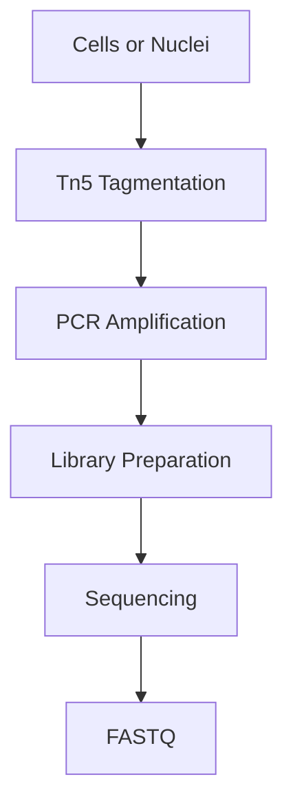
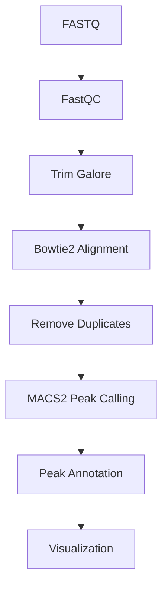

# 🧬 ATAC-Seq (Assay for Transposase-Accessible Chromatin using Sequencing)

> [!NOTE]
> **Module 2 • Lesson 11**
>
> Learn how ATAC-Seq identifies open chromatin regions to understand gene regulation and chromatin accessibility.

---

# 🎯 Learning Objectives

After completing this lesson, you will be able to:

- Explain ATAC-Seq.
- Understand chromatin accessibility.
- Learn how Tn5 transposase works.
- Create a Linux environment.
- Install analysis software.
- Perform a basic ATAC-Seq analysis.
- Answer common interview questions.

---

# 📚 Prerequisites

Before starting this lesson, you should know:

- DNA Structure
- Gene Regulation
- ChIP-Seq
- NGS Basics
- Linux Commands

---

# 💡 Real-Life Analogy

Imagine a library.

Some books are placed on **open shelves** where anyone can read them.

Other books are locked inside cabinets.

Open shelves = Open Chromatin

Locked cabinets = Closed Chromatin

ATAC-Seq tells us which DNA regions are open and available for transcription.

---

# 📌 What is ATAC-Seq?

ATAC-Seq is an NGS technique that identifies **open chromatin regions** using the **Tn5 transposase enzyme**.

These open regions are often:

- Promoters
- Enhancers
- Regulatory elements
- Transcription factor binding sites

---

# ❓ Why Perform ATAC-Seq?

ATAC-Seq helps answer questions like:

- Which regions of the genome are accessible?
- Which genes are likely to be active?
- Where are regulatory elements located?
- How does chromatin accessibility change between conditions?

---

# 📊 ATAC-Seq at a Glance

| Feature | Description |
|---------|-------------|
| Molecule | DNA |
| Target | Open Chromatin |
| Enzyme | Tn5 Transposase |
| Main Goal | Chromatin Accessibility |
| Output | Peaks of Accessible DNA |

---

# 🔬 How Does Tn5 Work?

Tn5 transposase simultaneously:

- Cuts open chromatin DNA.
- Inserts sequencing adapters.

This process is called **tagmentation**.

Only accessible DNA regions are efficiently tagged and sequenced.

---

# 🔬 Wet Lab Workflow



---

# 💻 Bioinformatics Workflow



---

# 🐧 Linux Environment

## Create Environment

```bash
conda create -n atacseq python=3.11 -y
```

Activate

```bash
conda activate atacseq
```

---

# 📦 Install Software

```bash
mamba install \
fastqc \
multiqc \
trim-galore \
bowtie2 \
samtools \
macs2 \
deeptools
```

---

# ✅ Verify Installation

```bash
fastqc --version

bowtie2 --version

samtools --version

macs2 --version

bamCoverage --version
```

---

# 📁 Project Structure

```text
ATACSeq_Project/

├── raw_data/
├── qc/
├── trimmed/
├── reference/
├── alignment/
├── peaks/
├── annotation/
├── visualization/
├── results/
├── scripts/
└── logs/
```

---

# 💻 Pipeline

## Step 1 – Quality Check

```bash
fastqc sample.fastq.gz
```

---

## Step 2 – Adapter Trimming

```bash
trim_galore sample.fastq.gz
```

---

## Step 3 – Build Genome Index

```bash
bowtie2-build genome.fa genome_index
```

---

## Step 4 – Alignment

```bash
bowtie2 \
-x genome_index \
-U sample.fastq.gz \
-S sample.sam
```

---

## Step 5 – Convert SAM to BAM

```bash
samtools view -Sb sample.sam > sample.bam
```

---

## Step 6 – Sort BAM

```bash
samtools sort sample.bam -o sample.sorted.bam
```

---

## Step 7 – Index BAM

```bash
samtools index sample.sorted.bam
```

---

## Step 8 – Peak Calling

```bash
macs2 callpeak \
-t sample.sorted.bam \
-f BAM \
-g hs \
-n atac_results
```

---

## Step 9 – Create Coverage File

```bash
bamCoverage \
-b sample.sorted.bam \
-o coverage.bw
```

---

# 📂 Input Files

| File | Description |
|------|-------------|
| FASTQ | Raw reads |
| Reference Genome | FASTA |

---

# 📂 Output Files

| File | Description |
|------|-------------|
| BAM | Aligned reads |
| narrowPeak | Accessible chromatin peaks |
| bigWig | Coverage track |
| Peak Annotation | Regulatory regions |

---

# 🏥 Applications

- Epigenetics
- Cancer Biology
- Developmental Biology
- Stem Cell Research
- Immunology
- Neuroscience

---

# ⚠️ Common Mistakes

> [!WARNING]
>
> - Poor nuclei isolation.
> - Over-tagmentation by Tn5.
> - Low sequencing depth.
> - High mitochondrial DNA contamination.
> - Ignoring duplicate reads.

---

# 🆚 ChIP-Seq vs ATAC-Seq

| Feature | ChIP-Seq | ATAC-Seq |
|----------|----------|----------|
| Measures | Protein-DNA Binding | Open Chromatin |
| Requires Antibody | ✅ Yes | ❌ No |
| Enzyme | None | Tn5 Transposase |
| Output | Protein Binding Peaks | Accessible Regions |

---

# 🧠 Interview Corner

### ❓ What is ATAC-Seq?

ATAC-Seq identifies open chromatin regions using Tn5 transposase to study chromatin accessibility.

---

### ❓ What is Tagmentation?

Tagmentation is the process where Tn5 simultaneously fragments DNA and inserts sequencing adapters.

---

### ❓ Why is ATAC-Seq faster than ChIP-Seq?

Because it does not require immunoprecipitation or antibodies, making library preparation simpler and faster.

---

### ❓ What is the main advantage of ATAC-Seq?

It provides a genome-wide view of chromatin accessibility with relatively low input material.

---

# 📝 Lesson Summary

- ATAC-Seq studies open chromatin.
- Uses Tn5 transposase for tagmentation.
- Identifies regulatory regions such as promoters and enhancers.
- MACS2 is commonly used for peak calling.
- Widely used in epigenetics and gene regulation studies.

---

# 📥 Recommended Practice Dataset

| Source | Dataset |
|---------|----------|
| ENCODE | Public ATAC-Seq datasets |
| GEO | Chromatin accessibility studies |
| SRA | Human and mouse ATAC-Seq datasets |

---

# 📚 References

- ENCODE Project
- ATAC-Seq Original Protocol (Buenrostro et al.)
- MACS2 Documentation
- deepTools Documentation
- Nature Methods

---

# ➡️ Next Lesson

**DNase-Seq**
