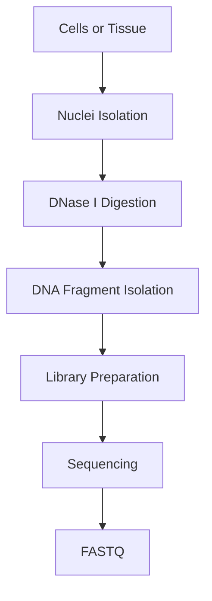
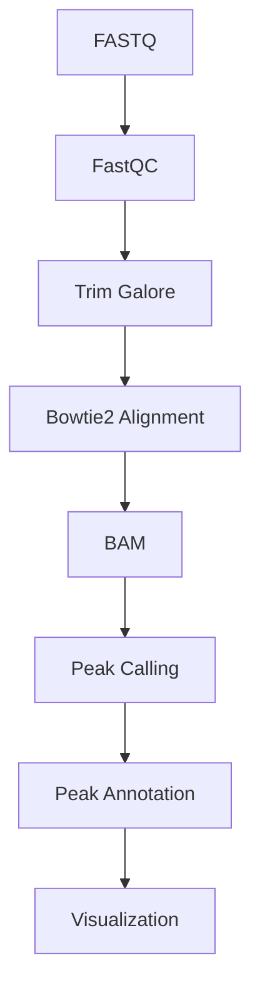

# 🧬 DNase-Seq (DNase I Hypersensitive Site Sequencing)

> [!NOTE]
> **Module 2 • Lesson 12**
>
> Learn how DNase-Seq identifies open chromatin regions by detecting DNA sites that are highly sensitive to DNase I digestion.

---

# 🎯 Learning Objectives

After completing this lesson, you will be able to:

- Explain DNase-Seq.
- Understand DNase I hypersensitive sites (DHSs).
- Compare DNase-Seq with ATAC-Seq and ChIP-Seq.
- Create a Linux environment.
- Install commonly used tools.
- Perform a basic DNase-Seq analysis.
- Answer interview questions confidently.

---

# 📚 Prerequisites

Before this lesson, you should know:

- DNA Structure
- Chromatin
- ChIP-Seq
- ATAC-Seq
- Linux Basics

---

# 💡 Real-Life Analogy

Imagine a house.

Some windows are open, while others are closed.

If rain falls:

- Open windows allow rain inside.
- Closed windows block the rain.

Similarly,

DNase I enzyme can easily cut DNA in **open chromatin** but cannot easily access DNA wrapped tightly around nucleosomes.

DNase-Seq identifies these open genomic regions.

---

# 📌 What is DNase-Seq?

DNase-Seq is a genome-wide sequencing technique used to identify **DNase I Hypersensitive Sites (DHSs)**, which represent open and accessible chromatin regions involved in gene regulation.

These regions often include:

- Promoters
- Enhancers
- Insulators
- Transcription factor binding sites

---

# ❓ Why Perform DNase-Seq?

DNase-Seq helps answer questions such as:

- Which regions of the genome are open?
- Where are regulatory elements located?
- Which genes are potentially active?
- Which transcription factors may bind these regions?

---

# 📊 DNase-Seq at a Glance

| Feature | Description |
|---------|-------------|
| Molecule | DNA |
| Target | DNase I Hypersensitive Sites |
| Main Goal | Open Chromatin Detection |
| Enzyme | DNase I |

---

# 🔬 Principle

DNase I preferentially cuts DNA in regions where chromatin is open and accessible.

After digestion:

- Small DNA fragments are isolated.
- Libraries are prepared.
- Fragments are sequenced.
- Peaks indicate accessible chromatin regions.

---

# 🔬 Wet Lab Workflow



---

# 💻 Bioinformatics Workflow



---

# 🐧 Linux Environment

## Create Environment

```bash
conda create -n dnaseseq python=3.11 -y
```

Activate

```bash
conda activate dnaseseq
```

---

# 📦 Install Software

```bash
mamba install \
fastqc \
multiqc \
trim-galore \
bowtie2 \
samtools \
macs2 \
deeptools
```

---

# ✅ Verify Installation

```bash
fastqc --version

bowtie2 --version

samtools --version

macs2 --version

bamCoverage --version
```

---

# 📁 Project Structure

```text
DNaseSeq_Project/

├── raw_data/
├── qc/
├── trimmed/
├── reference/
├── alignment/
├── peaks/
├── annotation/
├── visualization/
├── results/
├── scripts/
└── logs/
```

---

# 💻 Pipeline

## Step 1 – Quality Check

```bash
fastqc sample.fastq.gz
```

---

## Step 2 – Adapter Trimming

```bash
trim_galore sample.fastq.gz
```

---

## Step 3 – Build Genome Index

```bash
bowtie2-build genome.fa genome_index
```

---

## Step 4 – Alignment

```bash
bowtie2 \
-x genome_index \
-U sample.fastq.gz \
-S sample.sam
```

---

## Step 5 – Convert SAM to BAM

```bash
samtools view -Sb sample.sam > sample.bam
```

---

## Step 6 – Sort BAM

```bash
samtools sort sample.bam -o sample.sorted.bam
```

---

## Step 7 – Index BAM

```bash
samtools index sample.sorted.bam
```

---

## Step 8 – Peak Calling

```bash
macs2 callpeak \
-t sample.sorted.bam \
-f BAM \
-g hs \
-n dnase_results
```

---

## Step 9 – Coverage Track

```bash
bamCoverage \
-b sample.sorted.bam \
-o dnase_coverage.bw
```

---

# 📂 Input Files

| File | Description |
|------|-------------|
| FASTQ | Raw sequencing reads |
| Reference Genome | FASTA |

---

# 📂 Output Files

| File | Description |
|------|-------------|
| BAM | Aligned reads |
| narrowPeak | Accessible chromatin peaks |
| bigWig | Coverage track |
| Peak Annotation | Regulatory regions |

---

# 🏥 Applications

- Epigenetics
- Gene Regulation
- Developmental Biology
- Cancer Research
- Functional Genomics
- Regulatory Element Discovery

---

# ⚠️ Common Mistakes

> [!WARNING]
>
> - Over-digestion with DNase I.
> - Under-digestion leading to poor accessibility detection.
> - Low sequencing depth.
> - Incorrect peak-calling parameters.
> - Poor-quality nuclei preparation.

---

# 🆚 DNase-Seq vs ATAC-Seq

| Feature | DNase-Seq | ATAC-Seq |
|----------|-----------|----------|
| Enzyme | DNase I | Tn5 Transposase |
| Measures | Open Chromatin | Open Chromatin |
| Input Material | Higher | Lower |
| Library Preparation | More complex | Simpler |
| Popular Today | Less common | More common |

---

# 🧠 Interview Corner

### ❓ What is a DNase I Hypersensitive Site (DHS)?

A genomic region where chromatin is open and easily digested by DNase I, indicating potential regulatory activity.

---

### ❓ Why has ATAC-Seq become more popular than DNase-Seq?

ATAC-Seq requires fewer cells, has a simpler protocol, and uses Tn5 transposase to combine DNA fragmentation and adapter insertion in a single step.

---

### ❓ What do DNase-Seq peaks represent?

Regions of accessible chromatin that may contain promoters, enhancers, or transcription factor binding sites.

---

# 📝 Lesson Summary

- DNase-Seq identifies open chromatin using DNase I.
- DNase I hypersensitive sites are indicators of regulatory DNA.
- MACS2 can be used for peak calling.
- ATAC-Seq has largely replaced DNase-Seq in many applications due to its simpler workflow and lower input requirements.

---

# 📥 Recommended Practice Dataset

| Source | Dataset |
|---------|----------|
| ENCODE | Public DNase-Seq datasets |
| GEO | Chromatin accessibility studies |
| SRA | Human DNase-Seq datasets |

---

# 📚 References

- ENCODE Project
- Nature Methods
- MACS2 Documentation
- deepTools Documentation
- Bowtie2 Documentation

---

# ➡️ Next Lesson

**Hi-C Sequencing**
