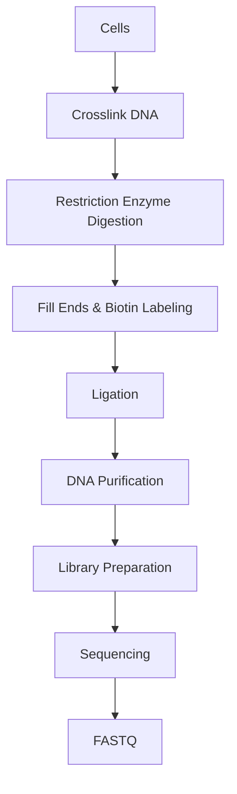
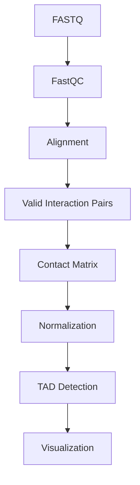

# 🧬 Hi-C Sequencing

> [!NOTE]
> **Module 2 • Lesson 13**
>
> Learn how Hi-C sequencing captures the three-dimensional (3D) organization of the genome by identifying chromatin interactions across the entire genome.

---

# 🎯 Learning Objectives

After completing this lesson, you will be able to:

- Explain Hi-C Sequencing.
- Understand 3D genome organization.
- Learn chromatin interactions and chromosome looping.
- Create a Linux environment.
- Install commonly used Hi-C tools.
- Understand contact matrices and TADs.
- Answer interview questions confidently.

---

# 📚 Prerequisites

Before this lesson, you should know:

- DNA Structure
- Chromosomes
- Chromatin
- Gene Regulation
- NGS Basics
- Linux Basics

---

# 💡 Real-Life Analogy

Imagine a long rope folded inside a small box.

Although two points may be **far apart** along the rope,

they may actually **touch each other** because the rope is folded.

The genome behaves in the same way.

Hi-C identifies DNA regions that physically interact inside the nucleus, even if they are far apart in the linear genome.

---

# 📌 What is Hi-C?

Hi-C is an NGS-based technique used to study the **three-dimensional (3D) organization of the genome** by identifying physical interactions between different genomic regions.

Instead of sequencing genes, Hi-C sequences **DNA-DNA interaction pairs**.

---

# ❓ Why Perform Hi-C?

Hi-C helps answer questions like:

- How is DNA folded inside the nucleus?
- Which genomic regions interact?
- What are Topologically Associating Domains (TADs)?
- Which enhancers interact with promoters?
- How do chromosomal rearrangements affect genome organization?

---

# 📊 Hi-C at a Glance

| Feature | Description |
|---------|-------------|
| Molecule | DNA |
| Main Goal | Genome-wide chromatin interactions |
| Output | Contact Matrix |
| Popular Tools | HiC-Pro, Juicer, Cooler |

---

# 🔑 Key Concepts

## Chromatin Interaction

Physical contact between two DNA regions inside the nucleus.

---

## Chromosome Loop

A DNA loop that brings distant genomic regions close together.

---

## TAD (Topologically Associating Domain)

A genomic region where DNA sequences interact more frequently with each other than with regions outside the domain.

---

## Contact Matrix

A matrix representing interaction frequencies between genomic regions.

---

# 🔬 Wet Lab Workflow



---

# 💻 Bioinformatics Workflow



---

# 🐧 Linux Environment

## Create Environment

```bash
conda create -n hic python=3.11 -y
```

Activate

```bash
conda activate hic
```

---

# 📦 Install Software

```bash
mamba install \
fastqc \
samtools \
bowtie2 \
hic-pro \
cooler
```

> [!IMPORTANT]
> **Juicer** is generally installed separately from its official repository and is not typically installed via Conda.

---

# ✅ Verify Installation

```bash
fastqc --version

bowtie2 --version

samtools --version

HiC-Pro -v

cooler --version
```

---

# 📁 Project Structure

```text
HiC_Project/

├── raw_data/
├── qc/
├── reference/
├── alignment/
├── matrices/
├── tad/
├── visualization/
├── results/
├── scripts/
└── logs/
```

---

# 💻 Pipeline

## Step 1 – Quality Check

```bash
fastqc sample_R1.fastq.gz sample_R2.fastq.gz
```

---

## Step 2 – Alignment

```bash
bowtie2 \
-x genome_index \
-1 sample_R1.fastq.gz \
-2 sample_R2.fastq.gz \
-S sample.sam
```

---

## Step 3 – Run HiC-Pro

```bash
HiC-Pro \
-i raw_data \
-o results \
-c config-hicpro.txt
```

---

## Step 4 – Generate Contact Matrix

HiC-Pro automatically generates normalized interaction matrices.

---

## Step 5 – Visualization

Example using Cooler

```bash
cooler info sample.cool
```

---

# 📂 Input Files

| File | Description |
|------|-------------|
| FASTQ | Raw paired-end reads |
| Reference Genome | FASTA |
| Restriction Fragment File | Restriction enzyme cut sites |

---

# 📂 Output Files

| File | Description |
|------|-------------|
| BAM | Aligned reads |
| Valid Pairs | Chromatin interactions |
| Contact Matrix | Interaction frequencies |
| .cool | Cooler matrix format |
| Heatmap | Genome interaction map |

---

# 🏥 Applications

- 3D Genome Organization
- Cancer Genomics
- Structural Variation
- Gene Regulation
- Developmental Biology
- Chromosome Architecture

---

# ⚠️ Common Mistakes

> [!WARNING]
>
> - Poor crosslinking efficiency.
> - Incorrect restriction enzyme information.
> - Low sequencing depth.
> - Poor normalization.
> - Misinterpreting contact heatmaps.

---

# 🧠 Interview Corner

### ❓ What is Hi-C?

Hi-C is an NGS technique used to identify physical interactions between genomic regions and study the three-dimensional organization of chromosomes.

---

### ❓ What is a Contact Matrix?

A matrix that shows how frequently different genomic regions interact with one another.

---

### ❓ What is a TAD?

A Topologically Associating Domain (TAD) is a genomic region where DNA sequences interact more frequently with each other than with regions outside the domain.

---

### ❓ Difference between ChIP-Seq and Hi-C?

| ChIP-Seq | Hi-C |
|-----------|------|
| Protein–DNA interactions | DNA–DNA interactions |
| Peaks | Contact matrices |
| Gene regulation | Genome architecture |

---

# 📝 Lesson Summary

- Hi-C studies genome architecture.
- Detects long-range chromatin interactions.
- Produces contact matrices and interaction heatmaps.
- HiC-Pro and Juicer are widely used analysis pipelines.
- Hi-C is essential for understanding chromosome organization.

---

# 📥 Recommended Practice Dataset

| Source | Dataset |
|---------|----------|
| ENCODE | Public Hi-C datasets |
| GEO | Hi-C studies |
| SRA | Human and mouse Hi-C datasets |

---

# 📚 References

- HiC-Pro Documentation
- Juicer Documentation
- Cooler Documentation
- ENCODE Project
- Nature Reviews Genetics

---

# ➡️ Next Lesson

**Immune Repertoire Sequencing**
