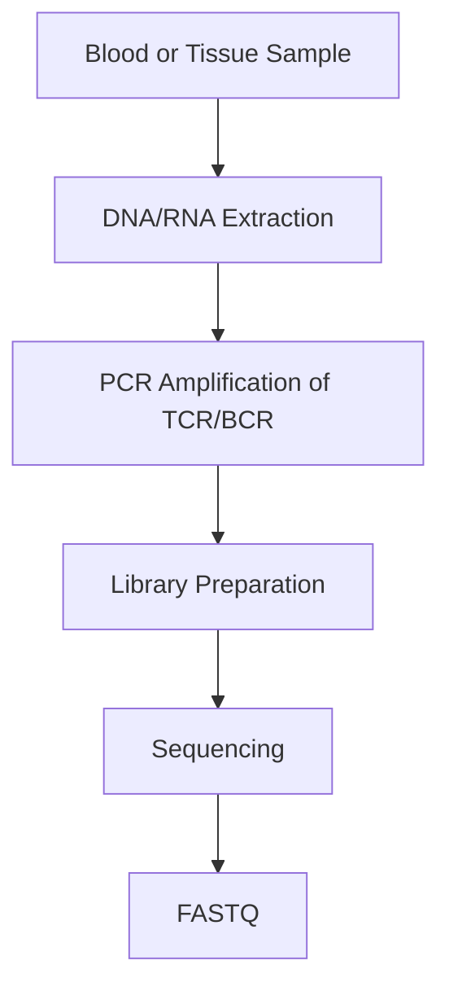

# 🛡️ Immune Repertoire Sequencing (TCR-Seq & BCR-Seq)

> [!NOTE]
> **Module 2 • Lesson 14**
>
> Learn how immune repertoire sequencing is used to analyze T-cell receptors (TCRs) and B-cell receptors (BCRs) for studying immune diversity, infections, cancer, and immunotherapy.

---

# 🎯 Learning Objectives

After completing this lesson, you will be able to:

- Explain Immune Repertoire Sequencing.
- Understand T-cell and B-cell receptors.
- Learn V(D)J recombination.
- Create a Linux environment.
- Install commonly used analysis software.
- Analyze immune receptor sequencing data.
- Answer interview questions confidently.

---

# 📚 Prerequisites

Before this lesson, you should know:

- DNA
- RNA
- Adaptive Immune System
- NGS Basics
- FASTQ Files
- Linux Basics

---

# 💡 Real-Life Analogy

Imagine every soldier in an army carries a **unique ID card**.

This unique ID allows each soldier to recognize a specific enemy.

Similarly,

each **T cell** and **B cell** carries a unique receptor.

Immune Repertoire Sequencing reads millions of these receptor sequences to understand how the immune system responds to diseases.

---

# 📌 What is Immune Repertoire Sequencing?

Immune Repertoire Sequencing (IR-Seq) is an NGS technique used to sequence **T-cell receptor (TCR)** and **B-cell receptor (BCR)** genes to study immune diversity, clonality, and immune responses.

---

# ❓ Why Perform Immune Repertoire Sequencing?

It helps answer questions such as:

- Which immune clones are present?
- How diverse is the immune system?
- Which T cells respond to infection?
- Which B cells produce antibodies?
- How does immunotherapy affect immune cells?

---

# 📊 Immune Repertoire at a Glance

| Feature | Description |
|---------|-------------|
| Molecule | DNA or RNA |
| Target | TCR / BCR Genes |
| Main Goal | Immune Diversity |
| Common Analysis | Clonotype Identification |

---

# 🧬 Key Concepts

## TCR (T-cell Receptor)

Found on T lymphocytes.

Recognizes antigens presented by MHC molecules.

---

## BCR (B-cell Receptor)

Found on B lymphocytes.

Recognizes free antigens and gives rise to antibodies.

---

## V(D)J Recombination

A natural process that randomly combines:

- V (Variable)
- D (Diversity)
- J (Joining)

gene segments to generate millions of unique immune receptors.

---

## Clonotype

A group of immune cells sharing the same receptor sequence.

---

# 🔬 Wet Lab Workflow



---

# 💻 Bioinformatics Workflow

```mermaid
flowchart TD
A[FASTQ] --> B[FastQC]
B --> C[MiXCR / IgBLAST]
C --> D[V(D)J Assignment]
D --> E[Clonotype Detection]
E --> F[Diversity Analysis]
E --> G[Visualization]
```

---

# 🐧 Linux Environment

## Create Environment

```bash
conda create -n immuneseq python=3.11 -y
```

Activate

```bash
conda activate immuneseq
```

---

# 📦 Install Software

```bash
mamba install \
fastqc \
samtools \
mixcr
```

> [!IMPORTANT]
> IgBLAST is provided by NCBI and is typically downloaded and configured separately.

---

# ✅ Verify Installation

```bash
fastqc --version

samtools --version

mixcr --version
```

---

# 📁 Project Structure

```text
ImmuneSeq_Project/

├── raw_data/
├── qc/
├── reference/
├── alignment/
├── clonotypes/
├── diversity/
├── results/
├── scripts/
└── logs/
```

---

# 💻 Pipeline

## Step 1 – Quality Check

```bash
fastqc sample.fastq.gz
```

---

## Step 2 – Identify Immune Receptors

```bash
mixcr analyze shotgun \
sample_R1.fastq.gz \
sample_R2.fastq.gz \
results/
```

---

## Step 3 – Export Clonotypes

```bash
mixcr exportClones \
results/clones.clns \
clonotypes.txt
```

---

# 📂 Input Files

| File | Description |
|------|-------------|
| FASTQ | Raw sequencing reads |
| Reference Database | V(D)J gene references |

---

# 📂 Output Files

| File | Description |
|------|-------------|
| Clonotypes | Immune receptor sequences |
| Diversity Report | Clonal diversity |
| V(D)J Assignments | Gene segment usage |

---

# 🏥 Applications

- Cancer Immunotherapy
- CAR-T Cell Therapy
- Vaccine Research
- Infectious Diseases
- Autoimmune Diseases
- Transplant Monitoring

---

# ⚠️ Common Mistakes

> [!WARNING]
>
> - Low sequencing depth.
> - PCR amplification bias.
> - Ignoring quality filtering.
> - Incorrect V(D)J reference database.

---

# 🧠 Interview Corner

### ❓ What is V(D)J recombination?

A natural genetic recombination process that generates diverse T-cell and B-cell receptors by rearranging Variable (V), Diversity (D), and Joining (J) gene segments.

---

### ❓ What is a clonotype?

A clonotype is a group of lymphocytes sharing the same TCR or BCR sequence, indicating a common origin.

---

### ❓ Why is MiXCR widely used?

MiXCR provides automated alignment, clonotype assembly, and immune repertoire analysis from sequencing data.

---

### ❓ Difference between RNA-Seq and Immune Repertoire Sequencing?

| RNA-Seq | Immune Repertoire Sequencing |
|----------|------------------------------|
| Gene expression | TCR/BCR diversity |
| Whole transcriptome | Immune receptor genes |
| Expression levels | Clonality and diversity |

---

# 📝 Lesson Summary

- Immune Repertoire Sequencing studies TCR and BCR genes.
- V(D)J recombination creates immune diversity.
- MiXCR is one of the most widely used analysis tools.
- Applications include cancer immunotherapy, vaccines, and infectious diseases.

---

# 📥 Recommended Practice Dataset

| Source | Dataset |
|---------|----------|
| SRA | Public TCR/BCR sequencing datasets |
| iReceptor | Immune repertoire datasets |
| NCBI | AIRR-compliant datasets |

---

# 📚 References

- MiXCR Documentation
- AIRR Community
- iReceptor Project
- Nature Immunology
- NCBI IgBLAST Documentation

---

# ➡️ Next Lesson

**Long-Read Sequencing (PacBio & Oxford Nanopore)**
