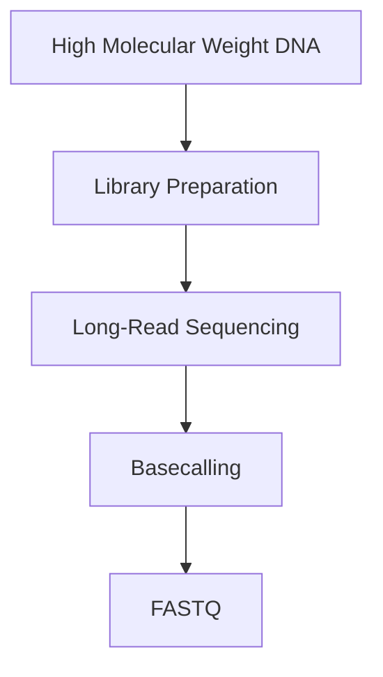
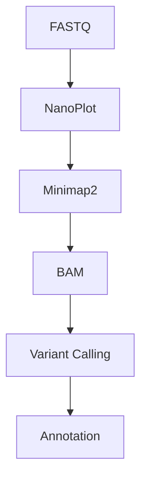

# 🧬 Long-Read Sequencing (PacBio & Oxford Nanopore)

> [!NOTE]
> **Module 2 • Lesson 15**
>
> Learn how third-generation sequencing technologies generate long DNA and RNA reads, enabling structural variant detection, de novo genome assembly, and direct epigenetic analysis.

---

# 🎯 Learning Objectives

After completing this lesson, you will be able to:

- Explain Long-Read Sequencing.
- Differentiate PacBio and Oxford Nanopore technologies.
- Understand long-read sequencing workflows.
- Create a Linux environment.
- Install commonly used software.
- Analyze long-read sequencing data.
- Answer interview questions confidently.

---

# 📚 Prerequisites

Before this lesson, you should know:

- DNA Structure
- NGS Basics
- FASTQ Format
- Genome Alignment
- Linux Basics

---

# 💡 Real-Life Analogy

Imagine reading a large book.

### Short-Read Sequencing

You tear the book into many small pieces.

Later, you try to reconstruct the original story.

This is difficult.

---

### Long-Read Sequencing

Instead, you read one complete chapter at a time.

Reconstructing the story becomes much easier.

Long-read sequencing follows this principle by sequencing much longer DNA fragments.

---

# 📌 What is Long-Read Sequencing?

Long-read sequencing is a sequencing technology capable of reading DNA or RNA fragments that are thousands to millions of bases long.

Unlike short-read sequencing (typically 100–300 bp), long-read sequencing can generate reads from several kilobases to over 100 kb, depending on sample quality and platform.

---

# ❓ Why Do We Need Long Reads?

Short reads often struggle with:

- Repetitive regions
- Structural variants
- Complex genomes
- Genome assembly
- Large insertions and deletions

Long reads solve many of these problems.

---

# 📊 Long-Read Sequencing at a Glance

| Feature | Description |
|---------|-------------|
| Technology | Third-Generation Sequencing |
| Read Length | Thousands to >100 kb |
| Main Goal | Long continuous DNA/RNA reads |
| Popular Platforms | PacBio SMRT, Oxford Nanopore |

---

# 🆚 PacBio vs Oxford Nanopore

| Feature | PacBio | Oxford Nanopore |
|----------|---------|-----------------|
| Technology | SMRT Sequencing | Nanopore Sequencing |
| Read Length | Long | Very Long |
| Accuracy | Very high (HiFi reads) | Continuously improving |
| Direct RNA Sequencing | ❌ | ✅ |
| Direct DNA Methylation | Limited | ✅ |
| Portable Devices | ❌ | ✅ MinION |

---

# 🔬 Principle

## PacBio

DNA polymerase synthesizes DNA inside tiny wells called **Zero-Mode Waveguides (ZMWs)**.

Fluorescent signals are detected in real time.

---

## Oxford Nanopore

DNA passes through a biological nanopore.

Changes in electrical current are measured.

These current changes are converted into DNA sequences by basecalling software.

---

# 🔬 Wet Lab Workflow



---

# 💻 Bioinformatics Workflow



---

# 🐧 Linux Environment

## Create Environment

```bash
conda create -n longread python=3.11 -y
```

Activate

```bash
conda activate longread
```

---

# 📦 Install Software

```bash
mamba install \
nanoplot \
minimap2 \
samtools \
flye \
medaka \
clair3
```

---

# ✅ Verify Installation

```bash
NanoPlot --version

minimap2 --version

samtools --version

flye --version
```

---

# 📁 Project Structure

```text
LongRead_Project/

├── raw_data/
├── qc/
├── reference/
├── alignment/
├── assembly/
├── variants/
├── methylation/
├── results/
├── scripts/
└── logs/
```

---

# 💻 Pipeline

## Step 1 – Quality Control

```bash
NanoPlot \
--fastq sample.fastq.gz \
--outdir qc
```

---

## Step 2 – Genome Alignment

```bash
minimap2 \
-ax map-ont \
reference.fa \
sample.fastq.gz \
> sample.sam
```

---

## Step 3 – Convert SAM to BAM

```bash
samtools view -Sb sample.sam > sample.bam
```

---

## Step 4 – Sort BAM

```bash
samtools sort sample.bam -o sample.sorted.bam
```

---

## Step 5 – Index BAM

```bash
samtools index sample.sorted.bam
```

---

## Step 6 – Variant Calling

Example using Clair3

```bash
run_clair3.sh
```

---

## Step 7 – Consensus Polishing

Example using Medaka

```bash
medaka_consensus
```

---

# 📂 Input Files

| File | Description |
|------|-------------|
| FASTQ | Long-read sequences |
| Reference Genome | FASTA |

---

# 📂 Output Files

| File | Description |
|------|-------------|
| BAM | Aligned reads |
| VCF | Variants |
| FASTA | Assembled genome |
| Consensus | Corrected sequence |

---

# 🏥 Applications

- Whole Genome Sequencing
- Structural Variant Detection
- De Novo Genome Assembly
- Transcript Isoform Analysis
- Direct RNA Sequencing
- DNA Methylation Analysis
- Microbial Genome Sequencing

---

# ⚠️ Common Mistakes

> [!WARNING]
>
> - Poor quality or fragmented DNA.
> - Choosing the wrong Minimap2 preset.
> - Skipping quality control.
> - Low sequencing depth.
> - Ignoring read quality before assembly.

---

# 🧠 Interview Corner

### ❓ What is Long-Read Sequencing?

Long-read sequencing generates DNA or RNA reads that are much longer than those produced by traditional short-read sequencing, making it useful for complex genome analysis.

---

### ❓ What is the difference between PacBio and Oxford Nanopore?

PacBio uses SMRT sequencing with fluorescent detection, while Oxford Nanopore measures changes in electrical current as DNA passes through a nanopore.

---

### ❓ Why use Minimap2?

Minimap2 is optimized for aligning long sequencing reads from Oxford Nanopore and PacBio platforms.

---

### ❓ What is the advantage of Oxford Nanopore?

It supports portable sequencing devices, direct RNA sequencing, and direct detection of DNA methylation without bisulfite treatment.

---

# 📝 Lesson Summary

- Long-read sequencing reads long DNA/RNA molecules.
- PacBio and Oxford Nanopore are leading third-generation sequencing technologies.
- Minimap2 is widely used for alignment.
- Flye is commonly used for de novo assembly.
- Medaka and Clair3 improve consensus accuracy and variant detection.
- Long reads are especially useful for structural variants, genome assembly, and complex genomic regions.

---

# 📥 Recommended Practice Dataset

| Source | Dataset |
|---------|----------|
| SRA | Oxford Nanopore public datasets |
| ENA | Nanopore and PacBio datasets |
| Nanopore Community | Example datasets |
| PacBio | HiFi demo datasets |

---

# 📚 References

- Oxford Nanopore Documentation
- PacBio Documentation
- Minimap2 Documentation
- Flye Documentation
- Medaka Documentation
- Clair3 Documentation
- Nature Biotechnology

---

# 🎉 Congratulations!

You have completed **Module 2 – Core Types of NGS Studies**.

---

# ➡️ Next Module

**Module 3 – Complete NGS Bioinformatics Workflow**

In Module 3, you'll move from theory to practice and learn how to analyze real sequencing data step by step using Linux and bioinformatics tools.
