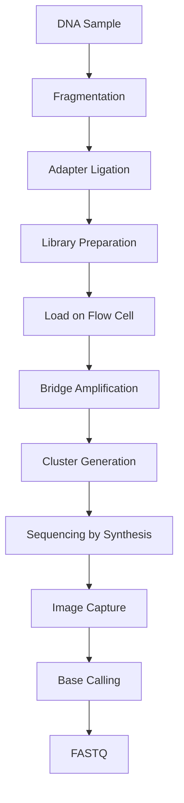

# 🔬 Illumina Sequencing

> [!NOTE]
> **Module 2.5 • Lesson 1**
>
> Learn how Illumina sequencing works, from DNA library preparation to base calling using Sequencing by Synthesis (SBS).

---

# 🎯 Learning Objectives

After completing this lesson, you will be able to:

- Explain Illumina Sequencing.
- Understand Sequencing by Synthesis (SBS).
- Learn about flow cells and bridge amplification.
- Understand cluster generation.
- Explain paired-end sequencing.
- Answer Illumina-related interview questions.

---

# 📚 Prerequisites

Before starting this lesson, you should know:

- DNA Structure
- NGS Basics
- Library Preparation

---

# 💡 Real-Life Analogy

Imagine photocopying a single page.

One copy is difficult to read from far away.

If you make **1,000 identical copies** and stack them together, the text becomes much easier to detect.

Illumina follows the same idea.

Instead of sequencing one DNA molecule,

it first creates **millions of identical copies (clusters)**.

Each cluster produces a stronger fluorescent signal.

---

# 📌 What is Illumina Sequencing?

Illumina Sequencing is a **Next-Generation Sequencing (NGS)** technology based on **Sequencing by Synthesis (SBS)**.

DNA fragments are attached to a flow cell, amplified into clusters, and sequenced one nucleotide at a time using fluorescently labeled reversible terminator nucleotides.

---

# 📊 Illumina at a Glance

| Feature | Description |
|---------|-------------|
| Technology | Sequencing by Synthesis (SBS) |
| Read Length | 50–300 bp |
| Accuracy | Very High |
| Throughput | High |
| Common Applications | WGS, WES, RNA-Seq, Metagenomics |

---

# 🔬 Illumina Workflow

---

# 🔑 Key Components

## 1. Flow Cell

A glass slide coated with oligonucleotides.

DNA fragments bind to these oligonucleotides before amplification.

---

## 2. Bridge Amplification

Each DNA fragment bends over and binds to a nearby oligonucleotide, forming a bridge.

DNA polymerase copies the fragment.

Repeated cycles produce **millions of identical copies**, forming a **cluster**.

---

## 3. Cluster Generation

Each cluster contains many identical DNA molecules.

Clusters generate strong fluorescent signals that can be detected by the sequencer.

---

## 4. Sequencing by Synthesis (SBS)

During each cycle:

1. One fluorescent nucleotide is incorporated.
2. A camera captures the emitted color.
3. The terminator is removed.
4. The next cycle begins.

One base is identified in every cycle.

---

# 🎨 Fluorescent Base Calling

Each nucleotide emits a unique fluorescent signal.

| Base | Signal |
|------|--------|
| A | Color 1 |
| T | Color 2 |
| G | Color 3 |
| C | Color 4 |

The instrument records these signals and converts them into DNA sequences.

---

# 📂 Output Files

| File | Description |
|------|-------------|
| BCL | Raw base call files generated by the instrument |
| FASTQ | Sequencing reads with quality scores |

---

# 🧠 Interview Corner

### ❓ What is Sequencing by Synthesis (SBS)?

A sequencing method where DNA polymerase adds one fluorescently labeled nucleotide at a time, allowing each incorporated base to be identified by imaging.

---

### ❓ Why is bridge amplification needed?

It generates clusters of identical DNA molecules, increasing signal intensity and improving sequencing accuracy.

---

### ❓ What is a flow cell?

A glass slide containing oligonucleotides where DNA fragments bind, amplify, and undergo sequencing.

---

### ❓ Why is Illumina highly accurate?

Because it sequences one base at a time using reversible terminator nucleotides and high-resolution imaging.

---

# ⚠️ Common Mistakes

> [!WARNING]
>
> - Confusing PCR amplification with bridge amplification.
> - Assuming each cluster contains a single DNA molecule.
> - Forgetting that Illumina produces short reads.

---

# 📝 Lesson Summary

- Illumina uses Sequencing by Synthesis (SBS).
- DNA fragments bind to a flow cell.
- Bridge amplification creates clusters.
- Fluorescent nucleotides enable base calling.
- Output is typically converted from BCL to FASTQ for downstream analysis.

---

# 📚 References

- Illumina Technology Overview
- Nature Reviews Genetics
- Illumina Sequencing by Synthesis Documentation

---

# ➡️ Next Lesson

**Ion Torrent Sequencing**
