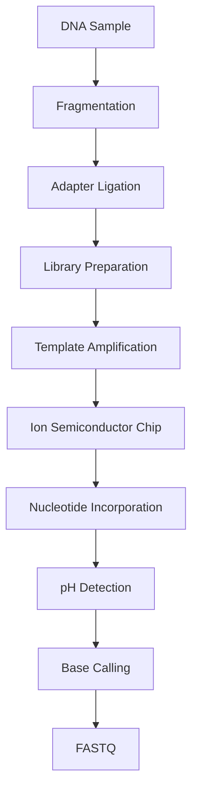

# ⚡ Ion Torrent Sequencing

> [!NOTE]
> **Module 2.5 • Lesson 2**
>
> Learn how Ion Torrent sequencing detects DNA bases by measuring hydrogen ions (H⁺) released during DNA synthesis instead of using fluorescence.

---

# 🎯 Learning Objectives

After completing this lesson, you will be able to:

- Explain Ion Torrent Sequencing.
- Understand semiconductor sequencing.
- Learn how hydrogen ion detection works.
- Compare Ion Torrent with Illumina.
- Explain advantages and limitations.
- Answer interview questions confidently.

---

# 📚 Prerequisites

Before starting this lesson, you should know:

- DNA Structure
- DNA Polymerase
- NGS Basics

---

# 💡 Real-Life Analogy

Imagine typing on a smartphone.

Each key press creates a tiny electrical signal.

The phone detects the signal and identifies which key was pressed.

Ion Torrent works in a similar way.

Instead of detecting fluorescent light, it detects tiny electrical (pH) changes caused by DNA synthesis.

---

# 📌 What is Ion Torrent Sequencing?

Ion Torrent Sequencing is a Next-Generation Sequencing (NGS) technology that detects DNA bases by measuring **hydrogen ions (H⁺)** released when DNA polymerase incorporates a nucleotide.

Unlike Illumina, it **does not use fluorescent labels or cameras**.

---

# 📊 Ion Torrent at a Glance

| Feature | Description |
|---------|-------------|
| Technology | Semiconductor Sequencing |
| Detection Method | Hydrogen ion (H⁺) release |
| Fluorescence | ❌ Not used |
| Camera | ❌ Not required |
| Read Length | ~200–600 bp (platform dependent) |
| Speed | Fast |

---

# 🔬 Principle

When DNA polymerase adds a nucleotide:

```
DNA + dNTP

↓

DNA Extension

↓

Hydrogen Ion (H⁺) Released

↓

pH Changes

↓

Semiconductor Chip Detects Signal
```

Each incorporated nucleotide releases a hydrogen ion.

The semiconductor chip measures the resulting pH change.

---

# 🔬 Sequencing Workflow



---

# 🔑 Key Components

## 1️⃣ Semiconductor Chip

Instead of cameras,

Ion Torrent uses a semiconductor chip containing millions of tiny wells.

Each well contains one DNA template.

---

## 2️⃣ DNA Polymerase

DNA polymerase incorporates nucleotides into the growing DNA strand.

Each incorporation releases one hydrogen ion.

---

## 3️⃣ Hydrogen Ion Detection

The chip measures changes in pH caused by released hydrogen ions.

No fluorescent dyes are required.

---

## 4️⃣ Base Calling

The instrument converts pH signals into DNA sequences.

---

# 🧪 Homopolymer Challenge

A **homopolymer** is a stretch of identical bases.

Example:

```text
AAAAAA
```

If several identical nucleotides are incorporated in one cycle, the signal intensity increases.

Estimating the exact number of repeated bases can be difficult, making homopolymers a known limitation of Ion Torrent.

---

# 📂 Output Files

| File | Description |
|------|-------------|
| BAM | Aligned reads (after analysis) |
| FASTQ | Sequencing reads |
| Quality Reports | Run metrics |

---

# 🆚 Illumina vs Ion Torrent

| Feature | Illumina | Ion Torrent |
|----------|----------|-------------|
| Detection | Fluorescence | pH Change |
| Camera | ✅ Yes | ❌ No |
| Fluorescent Labels | ✅ Yes | ❌ No |
| Sequencing Principle | Sequencing by Synthesis | Semiconductor Sequencing |
| Homopolymer Accuracy | Better | More challenging |
| Speed | High | Fast |

---

# 🏥 Applications

- Targeted Sequencing
- Small Gene Panels
- Cancer Mutation Analysis
- Microbial Genome Sequencing
- Clinical Diagnostics

---

# ⚠️ Common Mistakes

> [!WARNING]
>
> - Confusing pH detection with fluorescence.
> - Forgetting that no optical imaging is used.
> - Ignoring homopolymer limitations.

---

# 🧠 Interview Corner

### ❓ What makes Ion Torrent different from Illumina?

Ion Torrent detects hydrogen ions released during nucleotide incorporation, while Illumina detects fluorescent signals emitted by labeled nucleotides.

---

### ❓ Why doesn't Ion Torrent require a camera?

Because it measures pH changes electronically using semiconductor sensors instead of optical imaging.

---

### ❓ What is the major limitation of Ion Torrent?

Reduced accuracy in sequencing long homopolymer regions due to difficulty estimating the number of identical nucleotides incorporated in a single cycle.

---

# 📝 Lesson Summary

- Ion Torrent uses semiconductor sequencing.
- Detects hydrogen ions released during DNA synthesis.
- Does not require fluorescent dyes or cameras.
- Fast sequencing with relatively simple instrumentation.
- Homopolymer regions remain a key challenge.

---

# 📚 References

- Thermo Fisher Scientific – Ion Torrent Technology
- Nature Biotechnology
- Ion Torrent Documentation

---

# ➡️ Next Lesson

**PacBio SMRT Sequencing**
