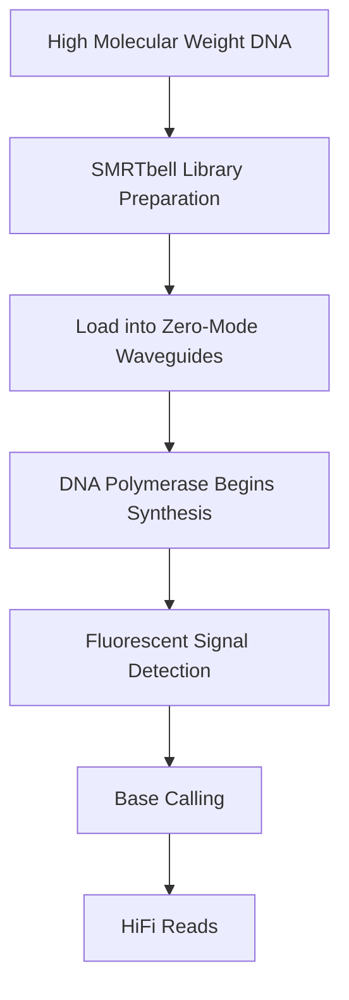

# 🧬 PacBio SMRT Sequencing (Single Molecule Real-Time Sequencing)

> [!NOTE]
> **Module 2.5 • Lesson 3**
>
> Learn how PacBio SMRT technology sequences individual DNA molecules in real time using DNA polymerase and fluorescent nucleotides.

---

# 🎯 Learning Objectives

After completing this lesson, you will be able to:

- Explain PacBio SMRT Sequencing.
- Understand Zero-Mode Waveguides (ZMWs).
- Learn how real-time sequencing works.
- Understand HiFi Reads.
- Compare PacBio with Illumina and Oxford Nanopore.
- Answer interview questions confidently.

---

# 📚 Prerequisites

Before starting this lesson, you should know:

- DNA Structure
- DNA Replication
- NGS Basics

---

# 💡 Real-Life Analogy

Imagine watching a person write a sentence.

Instead of reading the completed sentence later,

you watch each letter being written in real time.

PacBio works the same way.

It observes DNA polymerase adding one nucleotide at a time while DNA synthesis is happening.

---

# 📌 What is PacBio SMRT Sequencing?

PacBio SMRT (Single Molecule Real-Time) Sequencing is a third-generation sequencing technology that sequences **single DNA molecules** in real time.

Unlike second-generation sequencing, PacBio does **not require bridge amplification or cluster generation**.

Each DNA molecule is sequenced individually.

---

# 📊 PacBio at a Glance

| Feature | Description |
|---------|-------------|
| Technology | Single Molecule Real-Time (SMRT) |
| Sequencing Type | Third Generation |
| Amplification Required | ❌ No |
| Read Length | Long (10–100 kb or more) |
| High Accuracy Reads | ✅ HiFi Reads |
| Real-Time Sequencing | ✅ Yes |

---

# 🔬 Principle

PacBio sequencing occurs inside microscopic wells called **Zero-Mode Waveguides (ZMWs)**.

Each ZMW contains:

- One DNA polymerase
- One DNA template

As DNA polymerase incorporates fluorescently labeled nucleotides, light pulses are detected in real time.

The fluorescent label is released after incorporation, allowing DNA synthesis to continue.

---

# 🔬 Sequencing Workflow

---

# 🔑 Key Components

## 1️⃣ SMRTbell Library

PacBio DNA fragments are converted into circular DNA molecules called **SMRTbell libraries**.

This allows the polymerase to read the same DNA molecule multiple times.

---

## 2️⃣ Zero-Mode Waveguide (ZMW)

A tiny nanostructure where sequencing occurs.

Each ZMW contains one DNA molecule and one DNA polymerase.

---

## 3️⃣ DNA Polymerase

DNA polymerase synthesizes DNA naturally while fluorescent signals are recorded.

---

## 4️⃣ Circular Consensus Sequencing (CCS)

The polymerase reads the same circular DNA multiple times.

These repeated reads are combined to generate highly accurate **HiFi Reads**.

---

# ⭐ HiFi Reads

HiFi (High-Fidelity) Reads combine:

- Long read length
- Very high base accuracy

They are widely used for:

- Variant calling
- Genome assembly
- Clinical genomics

---

# 📂 Output Files

| File | Description |
|------|-------------|
| BAM | Raw PacBio reads |
| FASTQ | HiFi Reads |
| FASTA | Consensus Sequences |

---

# 🏥 Applications

- De Novo Genome Assembly
- Structural Variant Detection
- Full-Length Transcript Sequencing (Iso-Seq)
- Rare Disease Research
- Plant & Animal Genomics
- Clinical Genomics

---

# 🔬 Instrument Examples

| Instrument | Description |
|------------|-------------|
| Sequel IIe | High-throughput long-read sequencing |
| Revio | Latest high-throughput PacBio platform |

---

# 🆚 PacBio vs Illumina

| Feature | PacBio | Illumina |
|----------|---------|----------|
| Read Length | Long | Short |
| Amplification | No | Yes |
| Sequencing | Single Molecule | Cluster-Based |
| Accuracy | High (HiFi Reads) | Very High |
| Structural Variants | Excellent | Limited |

---

# 🆚 PacBio vs Oxford Nanopore

| Feature | PacBio | Oxford Nanopore |
|----------|---------|-----------------|
| Sequencing Principle | Fluorescent Detection | Electrical Signal Detection |
| Accuracy | Very High (HiFi) | Improving continuously |
| Direct RNA Sequencing | ❌ No | ✅ Yes |
| Direct DNA Methylation | Limited | ✅ Yes |

---

# ⚠️ Common Mistakes

> [!WARNING]
>
> - Confusing PacBio with Illumina.
> - Thinking PacBio requires PCR amplification.
> - Assuming all long reads have the same accuracy.
> - Ignoring the importance of HiFi reads.

---

# 🧠 Interview Corner

### ❓ What does SMRT stand for?

**Single Molecule Real-Time** Sequencing.

---

### ❓ What is a Zero-Mode Waveguide (ZMW)?

A tiny nanostructure where a single DNA molecule is sequenced in real time.

---

### ❓ What are HiFi Reads?

Highly accurate long reads generated using Circular Consensus Sequencing (CCS), where the same DNA molecule is read multiple times.

---

### ❓ Why is PacBio useful for genome assembly?

Because long reads span repetitive regions and complex genomic structures, making assembly more accurate and contiguous.

---

# 📝 Lesson Summary

- PacBio is a third-generation sequencing technology.
- Uses Single Molecule Real-Time sequencing.
- Sequencing occurs inside Zero-Mode Waveguides (ZMWs).
- HiFi reads provide long reads with very high accuracy.
- Widely used for genome assembly, structural variant detection, and transcriptomics.

---

# 📥 Recommended Practice Dataset

| Source | Dataset |
|---------|----------|
| PacBio | Public HiFi demo datasets |
| SRA | PacBio long-read datasets |
| ENA | Long-read sequencing datasets |

---

# 📚 References

- PacBio Documentation
- PacBio HiFi Sequencing Guide
- Nature Biotechnology
- SMRT Link Documentation

---

# ➡️ Next Lesson

**Oxford Nanopore Sequencing**
