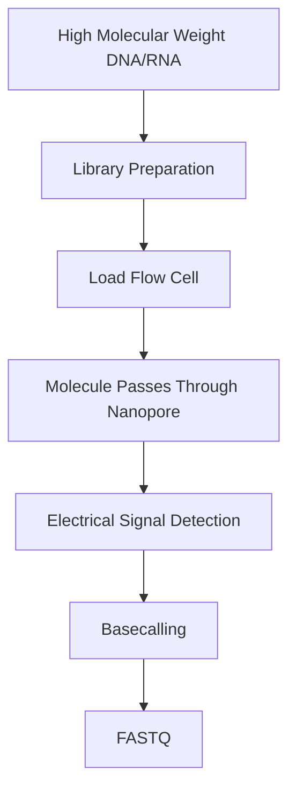

# 🧬 Oxford Nanopore Sequencing (ONT)

> [!NOTE]
> **Module 2.5 • Lesson 4**
>
> Learn how Oxford Nanopore Technology (ONT) sequences DNA and RNA by measuring changes in electrical current as molecules pass through nanopores.

---

# 🎯 Learning Objectives

After completing this lesson, you will be able to:

- Explain Oxford Nanopore Sequencing.
- Understand nanopore technology.
- Learn how electrical signal detection works.
- Understand basecalling.
- Compare ONT with Illumina and PacBio.
- Answer interview questions confidently.

---

# 📚 Prerequisites

Before starting this lesson, you should know:

- DNA Structure
- RNA Structure
- NGS Basics
- Long-Read Sequencing

---

# 💡 Real-Life Analogy

Imagine a narrow tunnel with a security scanner.

Every person passing through changes the scanner's signal slightly.

From those signal changes, the scanner identifies each person.

Oxford Nanopore works similarly.

As DNA or RNA molecules pass through a tiny nanopore, each nucleotide changes the electrical current in a unique way. These current changes are converted into DNA or RNA sequences.

---

# 📌 What is Oxford Nanopore Sequencing?

Oxford Nanopore Sequencing is a third-generation sequencing technology that sequences **single DNA or RNA molecules** by measuring changes in electrical current as they pass through a biological nanopore.

Unlike Illumina or PacBio, ONT does not rely on fluorescence.

---

# 📊 Oxford Nanopore at a Glance

| Feature | Description |
|---------|-------------|
| Technology | Nanopore Sequencing |
| Sequencing Type | Third Generation |
| Detection Method | Electrical Current |
| PCR Required | Optional (depends on protocol) |
| Read Length | Very Long (>100 kb possible) |
| Real-Time Analysis | ✅ Yes |
| Direct RNA Sequencing | ✅ Yes |
| Direct DNA Methylation Detection | ✅ Yes |

---

# 🔬 Principle

A motor protein controls the speed at which DNA or RNA passes through a nanopore embedded in a membrane.

As each nucleotide moves through the pore:

- It changes the electrical current.
- The sequencer records these signal changes.
- Basecalling software converts the signals into nucleotide sequences.

---

# 🔬 Sequencing Workflow

---

# 🔑 Key Components

## 1️⃣ Nanopore

A tiny protein pore embedded in a synthetic membrane.

DNA or RNA molecules pass through this pore one base at a time.

---

## 2️⃣ Motor Protein

Controls the movement of DNA or RNA through the nanopore at a constant speed.

---

## 3️⃣ Electrical Current

An electrical current continuously flows through the nanopore.

Each nucleotide changes the current in a characteristic way.

---

## 4️⃣ Basecalling

Software such as **Dorado** (current standard) converts electrical signals into nucleotide sequences.

---

# 🔬 Instrument Examples

| Instrument | Application |
|------------|-------------|
| MinION | Portable sequencing |
| GridION | Medium throughput |
| PromethION | High-throughput sequencing |
| Flongle | Small sequencing runs |

---

# 📂 Output Files

| File | Description |
|------|-------------|
| POD5 / FAST5 | Raw signal files |
| FASTQ | Basecalled reads |
| BAM | Aligned reads |
| VCF | Variant calls |

---

# 🏥 Applications

- Whole Genome Sequencing
- Structural Variant Detection
- De Novo Genome Assembly
- Metagenomics
- Direct RNA Sequencing
- DNA Methylation Analysis
- Pathogen Surveillance
- Clinical Genomics

---

# ⭐ Advantages

- Very long reads
- Portable devices (MinION)
- Real-time sequencing
- Direct RNA sequencing
- Direct DNA methylation detection
- Rapid field deployment

---

# ⚠️ Limitations

- Lower raw read accuracy than PacBio HiFi (although improving with newer chemistries and basecalling models)
- Requires high-quality, high-molecular-weight DNA for the longest reads
- Flow cell performance varies over time

---

# 🆚 Oxford Nanopore vs PacBio

| Feature | Oxford Nanopore | PacBio |
|----------|-----------------|---------|
| Detection | Electrical Current | Fluorescence |
| Sequencing | Nanopore | SMRT |
| Direct RNA Sequencing | ✅ | ❌ |
| Direct DNA Methylation | ✅ | Limited |
| Portable Devices | ✅ | ❌ |
| HiFi Reads | ❌ | ✅ |

---

# 🆚 Oxford Nanopore vs Illumina

| Feature | Oxford Nanopore | Illumina |
|----------|-----------------|----------|
| Read Length | Very Long | Short |
| Sequencing Speed | Real-Time | Run completes before analysis |
| Direct RNA | ✅ | ❌ |
| Direct Methylation | ✅ | ❌ |
| Portability | Portable options | Benchtop to large instruments |

---

# 🧠 Interview Corner

### ❓ What is Oxford Nanopore Sequencing?

A third-generation sequencing technology that identifies DNA or RNA bases by measuring changes in electrical current as molecules pass through nanopores.

---

### ❓ What is Basecalling?

Basecalling is the process of converting raw electrical signals generated during sequencing into nucleotide sequences (A, T, G, C).

---

### ❓ What is the biggest advantage of Oxford Nanopore?

It supports real-time sequencing, very long reads, portable instruments, direct RNA sequencing, and direct DNA methylation detection.

---

### ❓ Why is MinION popular?

Because it is compact, portable, and can perform sequencing outside traditional laboratories.

---

# 📝 Lesson Summary

- Oxford Nanopore uses nanopores instead of fluorescence.
- DNA or RNA is sequenced by measuring electrical current changes.
- Produces very long reads.
- Supports direct RNA sequencing and direct methylation detection.
- Commonly used for genome assembly, metagenomics, and structural variant analysis.

---

# 📥 Recommended Practice Dataset

| Source | Dataset |
|---------|----------|
| Oxford Nanopore Community | Demo datasets |
| ENA | Nanopore sequencing datasets |
| SRA | Human and microbial ONT datasets |

---

# 🏢 Companies Using This Technology

- Oxford Nanopore Technologies
- Hospitals using rapid pathogen sequencing
- Public health laboratories
- Research institutes
- Clinical genomics laboratories

---

# 📚 References

- Oxford Nanopore Documentation
- Dorado Documentation
- MinKNOW Documentation
- Nature Biotechnology
- Nature Methods

---

# ➡️ Next Lesson

**BGI / MGI Sequencing**
