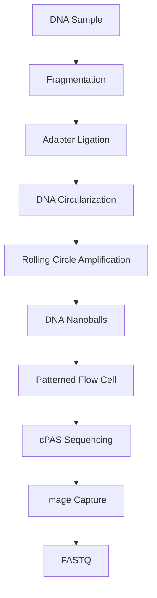

# 🧬 BGI / MGI Sequencing (DNBSEQ Technology)

> [!NOTE]
> **Module 2.5 • Lesson 5**
>
> Learn how BGI/MGI sequencing works using DNA Nanoball (DNB) technology and Combinatorial Probe-Anchor Synthesis (cPAS).

---

# 🎯 Learning Objectives

After completing this lesson, you will be able to:

- Explain BGI and MGI sequencing.
- Understand DNA Nanoball (DNB) technology.
- Learn cPAS sequencing chemistry.
- Compare MGI with Illumina.
- Understand advantages and limitations.
- Answer interview questions confidently.

---

# 📚 Prerequisites

Before starting this lesson, you should know:

- DNA Structure
- NGS Basics
- Illumina Sequencing

---

# 💡 Real-Life Analogy

Imagine placing thousands of identical marbles neatly on a large board.

Each marble is separated from the others, making it easy to identify individually.

BGI sequencing follows a similar concept.

Instead of amplified clusters, it places **DNA Nanoballs (DNBs)** in an ordered pattern on a sequencing chip.

---

# 📌 What is BGI / MGI Sequencing?

BGI (Beijing Genomics Institute) developed sequencing platforms that are now commercialized by **MGI Tech**.

MGI sequencing uses:

- **DNA Nanoballs (DNBs)** for template preparation.
- **Combinatorial Probe-Anchor Synthesis (cPAS)** for sequencing.

Unlike Illumina, it does **not use bridge amplification**.

---

# 📊 BGI/MGI at a Glance

| Feature | Description |
|---------|-------------|
| Technology | DNBSEQ |
| Sequencing Chemistry | cPAS |
| Amplification | Rolling Circle Amplification |
| Read Length | 50–300 bp |
| Throughput | High |
| Common Applications | WGS, WES, RNA-Seq, Clinical Genomics |

---

# 🔬 Principle

The sequencing process includes:

1. DNA fragmentation.
2. Adapter ligation.
3. Circularization of DNA fragments.
4. Rolling Circle Amplification (RCA).
5. Formation of DNA Nanoballs (DNBs).
6. Loading DNBs onto a patterned chip.
7. Sequencing using cPAS chemistry.

---

# 🔬 Sequencing Workflow

---

# 🔑 Key Components

## 1️⃣ DNA Nanoballs (DNBs)

DNA is circularized and amplified using **Rolling Circle Amplification (RCA)** to produce compact DNA nanoballs.

Advantages:

- High signal intensity.
- Lower error rates.
- Reduced duplication.

---

## 2️⃣ Rolling Circle Amplification (RCA)

Instead of PCR,

DNA is amplified continuously around a circular template.

Benefits include:

- Reduced amplification bias.
- Lower error introduction.

---

## 3️⃣ cPAS (Combinatorial Probe-Anchor Synthesis)

A sequencing chemistry where fluorescently labeled nucleotides are incorporated and detected.

This is conceptually similar to sequencing by synthesis but uses MGI's proprietary chemistry.

---

# 🔬 Instrument Examples

| Instrument | Application |
|------------|-------------|
| DNBSEQ-G50 | Small to medium projects |
| DNBSEQ-G99 | Clinical sequencing |
| DNBSEQ-G400 | Medium throughput |
| DNBSEQ-T7 | Large population studies |

---

# 📂 Output Files

| File | Description |
|------|-------------|
| FASTQ | Sequencing reads |
| BAM | Aligned reads (after analysis) |
| QC Reports | Run quality metrics |

---

# 🏥 Applications

- Whole Genome Sequencing
- Whole Exome Sequencing
- RNA Sequencing
- Cancer Genomics
- Population Genomics
- Clinical Diagnostics

---

# ⭐ Advantages

- High throughput.
- Reduced PCR bias through RCA.
- Ordered DNB placement improves signal quality.
- Competitive sequencing costs.
- Suitable for large-scale genomics projects.

---

# ⚠️ Limitations

- Less widespread than Illumina in some regions.
- Uses proprietary sequencing chemistry.
- Some analysis workflows may require platform-specific considerations.

---

# 🆚 MGI vs Illumina

| Feature | MGI | Illumina |
|----------|-----|----------|
| Amplification | Rolling Circle Amplification | Bridge Amplification |
| Template | DNA Nanoballs | Clusters |
| Flow Cell | Patterned chip | Flow cell |
| Sequencing Chemistry | cPAS | Sequencing by Synthesis |
| Read Length | Short | Short |

---

# 🧠 Interview Corner

### ❓ What is DNBSEQ?

DNBSEQ is MGI's sequencing technology that uses DNA Nanoballs and cPAS chemistry for high-throughput DNA sequencing.

---

### ❓ What are DNA Nanoballs?

DNA Nanoballs are compact DNA structures produced by Rolling Circle Amplification and used as sequencing templates.

---

### ❓ What is Rolling Circle Amplification?

Rolling Circle Amplification is an isothermal DNA amplification method that repeatedly copies circular DNA molecules without traditional PCR cycling.

---

### ❓ What is the difference between Illumina and MGI?

Illumina uses bridge amplification to generate clusters on a flow cell, whereas MGI uses Rolling Circle Amplification to create DNA Nanoballs that are loaded onto a patterned chip.

---

# 📝 Lesson Summary

- MGI sequencing is based on DNBSEQ technology.
- DNA Nanoballs are generated by Rolling Circle Amplification.
- cPAS is the sequencing chemistry used by MGI.
- MGI platforms are widely used for research and clinical genomics.

---

# 📥 Recommended Practice Dataset

| Source | Dataset |
|---------|----------|
| CNGB | Public MGI datasets |
| GEO | MGI sequencing studies |
| SRA | DNBSEQ sequencing datasets |

---

# 🏢 Companies Using This Technology

- MGI Tech
- BGI Research
- Hospitals using DNBSEQ platforms
- Population genomics projects
- Clinical sequencing laboratories

---

# 📚 References

- MGI Tech Documentation
- BGI Research Publications
- Nature Biotechnology
- DNBSEQ Technology White Papers

---

# ➡️ Next Lesson

**Single-End vs Paired-End Sequencing**
