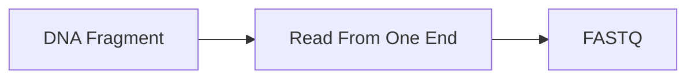
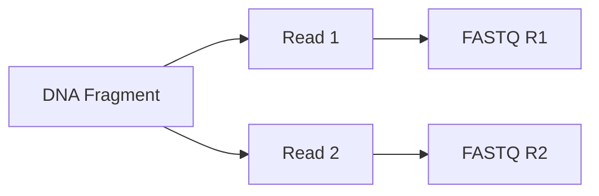

# 🔄 Single-End vs Paired-End Sequencing

> [!NOTE]
> **Module 2.5 • Lesson 6**
>
> Learn the difference between Single-End (SE) and Paired-End (PE) sequencing, their workflows, advantages, limitations, and applications.

---

# 🎯 Learning Objectives

After completing this lesson, you will be able to:

- Explain Single-End sequencing.
- Explain Paired-End sequencing.
- Compare SE and PE sequencing.
- Understand insert size.
- Choose the appropriate sequencing strategy.
- Answer interview questions confidently.

---

# 📚 Prerequisites

Before starting this lesson, you should know:

- DNA Structure
- Library Preparation
- Illumina Sequencing

---

# 💡 Real-Life Analogy

Imagine reading a book.

### Single-End Sequencing

You only read the **first page**.

You get some information.

---

### Paired-End Sequencing

You read the **first page and the last page**.

Now you understand the story much better.

DNA sequencing works the same way.

---

# 📌 What is Single-End Sequencing?

Single-End (SE) Sequencing reads DNA from **only one end** of each DNA fragment.

```
DNA Fragment

5' ------------------------- 3'

↓

Read

>>>>>>>>>>>>>>>>>>>>
```

Each DNA fragment generates **one sequencing read**.

---

# 📌 What is Paired-End Sequencing?

Paired-End (PE) Sequencing reads DNA from **both ends** of the same DNA fragment.

```
DNA Fragment

5' ------------------------- 3'

↓

Read 1 >>>>>>>>>>

<<<<<<<< Read 2
```

Each DNA fragment generates **two sequencing reads**.

---

# 🔬 Sequencing Workflow

## Single-End



---

## Paired-End



---

# 📊 At a Glance

| Feature | Single-End | Paired-End |
|----------|------------|------------|
| Reads per Fragment | 1 | 2 |
| Accuracy | Good | Higher |
| Structural Variant Detection | Limited | Better |
| Genome Assembly | Limited | Better |
| Cost | Lower | Higher |
| Analysis Complexity | Lower | Higher |

---

# 🔑 Key Concept: Insert Size

The **insert size** is the DNA fragment located between the sequencing adapters.

Example:

```
Adapter ---- DNA Fragment ---- Adapter

<--------- Insert --------->
```

In paired-end sequencing:

- Read 1 starts from one adapter.
- Read 2 starts from the opposite adapter.

Knowing the insert size helps improve read alignment and detect structural variants.

---

# 📂 Output Files

## Single-End

```
sample.fastq.gz
```

---

## Paired-End

```
sample_R1.fastq.gz

sample_R2.fastq.gz
```

---

# 🏥 Applications

## Single-End

- Gene Expression Quantification
- Small RNA Sequencing
- Some ChIP-Seq experiments
- Initial Quality Assessment

---

## Paired-End

- Whole Genome Sequencing
- Whole Exome Sequencing
- RNA-Seq
- Metagenomics
- Structural Variant Detection
- De Novo Genome Assembly

---

# ⭐ Advantages

## Single-End

- Lower sequencing cost.
- Faster analysis.
- Smaller data size.

---

## Paired-End

- Improved alignment accuracy.
- Better mapping across repetitive regions.
- Better detection of insertions and deletions.
- Supports structural variant analysis.
- Improved genome assembly.

---

# ⚠️ Limitations

## Single-End

- Lower mapping confidence.
- Less information.
- Limited structural variant detection.

---

## Paired-End

- Higher sequencing cost.
- Larger storage requirements.
- Longer analysis time.

---

# 💻 Example FASTQ Files

## Single-End

```
sample.fastq.gz
```

---

## Paired-End

```
sample_R1.fastq.gz

sample_R2.fastq.gz
```

---

# 🧠 Interview Corner

### ❓ What is Single-End Sequencing?

Single-End sequencing reads DNA from only one end of each DNA fragment, producing one read per fragment.

---

### ❓ What is Paired-End Sequencing?

Paired-End sequencing reads DNA from both ends of the same DNA fragment, producing two reads per fragment.

---

### ❓ Why is Paired-End sequencing more accurate?

Because information from both ends of the DNA fragment improves alignment, especially in repetitive regions and complex genomes.

---

### ❓ Which sequencing strategy is commonly used for WGS?

Paired-End sequencing, because it provides better genome coverage, alignment accuracy, and structural variant detection.

---

### ❓ What do R1 and R2 mean?

- **R1** = Read generated from the first end of the DNA fragment.
- **R2** = Read generated from the opposite end of the same DNA fragment.

---

# 📝 Lesson Summary

- Single-End sequencing generates one read per DNA fragment.
- Paired-End sequencing generates two reads per DNA fragment.
- Paired-End provides better mapping accuracy and structural variant detection.
- Most modern WGS, WES, and RNA-Seq experiments use paired-end sequencing.

---

# 📥 Recommended Practice Dataset

| Source | Dataset |
|---------|----------|
| SRA | Illumina paired-end datasets |
| ENA | RNA-Seq paired-end FASTQ files |
| GEO | Public sequencing projects |

---

# 📚 References

- Illumina Documentation
- Nature Reviews Genetics
- Illumina Paired-End Sequencing Guide

---

# ➡️ Next Lesson

**Read Length, Coverage & Sequencing Depth**
