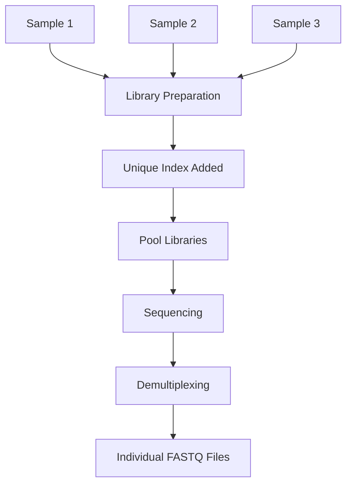

# 🏷️ Multiplexing, Indexing & Barcoding

> [!NOTE]
> **Module 2.5 • Lesson 8**
>
> Learn how multiple DNA samples are sequenced together using unique index and barcode sequences, making NGS faster and more cost-effective.

---

# 🎯 Learning Objectives

After completing this lesson, you will be able to:

- Explain Multiplexing.
- Understand Indexing and Barcoding.
- Learn how samples are identified after sequencing.
- Differentiate single indexing and dual indexing.
- Understand demultiplexing.
- Answer interview questions confidently.

---

# 📚 Prerequisites

Before starting this lesson, you should know:

- DNA Structure
- Library Preparation
- Adapter Ligation
- Illumina Sequencing

---

# 💡 Real-Life Analogy

Imagine sending luggage through an airport.

Every suitcase has a baggage tag.

Although thousands of bags travel together,

the tag identifies the correct owner.

Similarly,

every DNA sample receives a unique index (barcode),

allowing many samples to be sequenced together.

---

# 📌 What is Multiplexing?

Multiplexing is the process of sequencing **multiple DNA libraries in a single sequencing run**.

Each sample receives a unique index (barcode), allowing the sequencer to distinguish between samples after sequencing.

---

# ❓ Why Use Multiplexing?

Instead of sequencing:

```
Sample A

↓

Run 1

Sample B

↓

Run 2

Sample C

↓

Run 3
```

We can sequence all samples together:

```
Sample A

Sample B

Sample C

↓

One Sequencing Run

↓

Separate Later
```

Benefits:

- Saves time
- Reduces cost
- Increases instrument efficiency
- Maximizes sequencing throughput

---

# 📊 Multiplexing at a Glance

| Feature | Description |
|---------|-------------|
| Purpose | Sequence multiple samples together |
| Identification | Index sequences |
| Cost | Lower per sample |
| Output | Separate FASTQ files after demultiplexing |

---

# 📌 What is an Index?

An **index** is a short DNA sequence added to a library during library preparation.

Each sample receives a unique index.

Example:

| Sample | Index |
|---------|-------|
| Sample 1 | ATCGTG |
| Sample 2 | GCTAAC |
| Sample 3 | TTAAGC |

After sequencing, reads are assigned back to the correct sample using these index sequences.

---

# 📌 What is a Barcode?

A barcode is another name often used for a unique identifying DNA sequence.

In many workflows, the terms **index** and **barcode** are used interchangeably, although some protocols use "barcode" for broader labeling strategies (for example, cell barcodes in single-cell sequencing).

---

# 📌 Single Indexing

Each DNA fragment receives **one index**.

```
Adapter

↓

Index

↓

DNA Fragment
```

Advantages:

- Simple
- Lower cost

Limitation:

- Higher chance of sample misassignment compared with dual indexing.

---

# 📌 Dual Indexing

Each DNA fragment receives **two indexes**.

```
Index 1

↓

DNA Fragment

↓

Index 2
```

Advantages:

- Higher accuracy
- Reduced index hopping effects
- Better sample identification

---

# 🔬 Workflow



---

# 📌 What is Demultiplexing?

After sequencing,

software reads the index sequences

and separates the sequencing reads

back into individual samples.

Example:

```
Sequencing Output

↓

Read

↓

Index = ATCGTG

↓

Sample 1
```

---

# 📊 Multiplexing Workflow

```
DNA Samples

↓

Library Preparation

↓

Index Addition

↓

Pool Samples

↓

Sequencing

↓

Demultiplexing

↓

FASTQ Files
```

---

# 📂 Output Files

Example:

```
Sample1_R1.fastq.gz

Sample1_R2.fastq.gz

Sample2_R1.fastq.gz

Sample2_R2.fastq.gz

Sample3_R1.fastq.gz

Sample3_R2.fastq.gz
```

---

# 🏥 Applications

- Whole Genome Sequencing
- Whole Exome Sequencing
- RNA-Seq
- Metagenomics
- Targeted Sequencing
- Single-Cell Sequencing

---

# ⭐ Advantages

- Lower sequencing cost.
- Multiple samples in one run.
- Better instrument utilization.
- Faster project completion.

---

# ⚠️ Limitations

- Incorrect index assignment can misclassify reads.
- Low-quality index reads may reduce demultiplexing accuracy.
- Careful library preparation is required.

---

# 🧠 Interview Corner

### ❓ What is Multiplexing?

Multiplexing is sequencing multiple samples together in one sequencing run using unique index sequences.

---

### ❓ What is an Index?

A short DNA sequence added to each library to identify the sample after sequencing.

---

### ❓ What is Demultiplexing?

Demultiplexing is the process of separating sequencing reads into individual samples based on their index sequences.

---

### ❓ Why is Dual Indexing preferred?

Because it reduces sample misassignment and improves sequencing accuracy, especially in high-throughput sequencing.

---

### ❓ Can RNA-Seq use Multiplexing?

Yes.

Almost all modern RNA-Seq experiments multiplex multiple libraries in a single sequencing run.

---

# 📝 Lesson Summary

- Multiplexing allows multiple samples to be sequenced together.
- Indexes uniquely identify each sample.
- Demultiplexing separates reads after sequencing.
- Dual indexing improves sample identification accuracy.
- Multiplexing is widely used across most NGS applications.

---

# ⚡ Quick Revision

| Question | Answer |
|----------|--------|
| Multiplexing? | Sequence multiple samples together |
| Index? | DNA tag identifying a sample |
| Barcode? | Unique DNA identifier (often synonymous with index) |
| Demultiplexing? | Separating reads by index |
| Dual Indexing? | Two indexes per sample for improved accuracy |

---

# 📚 References

- Illumina Indexing Guide
- Illumina Library Preparation Documentation
- Nature Reviews Genetics

---

# ➡️ Next Lesson

**Flow Cell, Cluster Generation & Bridge Amplification**
