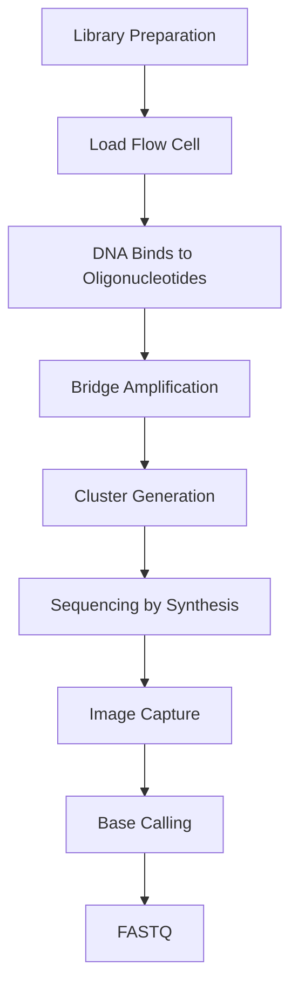

# 🔬 Flow Cell, Cluster Generation & Bridge Amplification

> [!NOTE]
> **Module 2.5 • Lesson 9**
>
> Learn how Illumina sequencing generates millions of DNA clusters on a flow cell through bridge amplification, enabling high-throughput sequencing.

---

# 🎯 Learning Objectives

After completing this lesson, you will be able to:

- Explain what a Flow Cell is.
- Understand Cluster Generation.
- Explain Bridge Amplification.
- Understand why clusters are required.
- Learn about Cluster Density.
- Answer interview questions confidently.

---

# 📚 Prerequisites

Before starting this lesson, you should know:

- DNA Structure
- Library Preparation
- Adapter Ligation
- Illumina Sequencing

---

# 💡 Real-Life Analogy

Imagine you are in a large football stadium at night.

If only **one person** switches on a flashlight,

the light is difficult to notice.

If **50,000 people** switch on identical flashlights,

the stadium becomes brightly illuminated.

Illumina sequencing works in the same way.

Instead of sequencing one DNA molecule,

it first creates **millions of identical DNA copies** (called a cluster).

These clusters produce a strong fluorescent signal that can be detected accurately.

---

# 📌 What is a Flow Cell?

A **Flow Cell** is a specially designed glass chip where DNA fragments bind, amplify, and are sequenced.

It contains millions to billions of microscopic locations where sequencing reactions occur simultaneously.

---

# 📊 Flow Cell at a Glance

| Feature | Description |
|---------|-------------|
| Material | Glass chip |
| Function | Holds DNA fragments during sequencing |
| Contains | Oligonucleotides attached to the surface |
| Used In | Illumina Sequencers |

---

# 🔬 Structure of a Flow Cell

```
------------------------------------------------------

Flow Cell Surface

○ ○ ○ ○ ○ ○ ○ ○ ○ ○ ○ ○ ○ ○ ○

Each ○ represents an oligonucleotide attached to the surface.

DNA fragments bind to these oligonucleotides through their adapters.

------------------------------------------------------
```

---

# 📌 What is Bridge Amplification?

Bridge Amplification is the process of creating **millions of identical copies of one DNA fragment** directly on the flow cell.

Unlike conventional PCR, amplification occurs while the DNA remains attached to the flow cell surface.

---

# 🔬 How Bridge Amplification Works

### Step 1 – DNA Binding

DNA fragments with adapters attach to complementary oligonucleotides on the flow cell.

```
Flow Cell

|

DNA Fragment
```

---

### Step 2 – Bridge Formation

The free end of the DNA fragment bends over and binds to a nearby oligonucleotide.

```
DNA

∩

Bridge
```

---

### Step 3 – DNA Synthesis

DNA polymerase synthesizes the complementary strand.

```
DNA

↓

Double-Stranded DNA
```

---

### Step 4 – Denaturation

The double-stranded DNA separates into two single strands.

Each strand remains attached to the flow cell.

```
DNA

↓

DNA      DNA
```

---

### Step 5 – Repeat

The process repeats many times.

One DNA molecule becomes:

```
1

↓

2

↓

4

↓

8

↓

16

↓

Thousands

↓

Millions
```

---

# 📌 What is a Cluster?

A **Cluster** is a group of thousands to millions of identical DNA molecules generated from a single original DNA fragment.

Each cluster represents one DNA fragment and produces a strong fluorescent signal during sequencing.

---

# 📊 Cluster Generation

```
One DNA Fragment

↓

Bridge Amplification

↓

Cluster

●●●●●●●●●●●●●

(Millions of identical copies)
```

---

# ❓ Why Are Clusters Needed?

A single DNA molecule emits a very weak fluorescent signal.

Clusters amplify the signal so that cameras can accurately identify each incorporated nucleotide during sequencing.

Without clusters:

- Weak signals
- Low accuracy
- Difficult base calling

---

# 📌 Cluster Density

Cluster Density refers to the number of clusters present on a flow cell.

---

## Low Cluster Density

```
●      ●

      ●

●
```

Advantages:

- High-quality reads

Disadvantages:

- Lower sequencing output

---

## Optimal Cluster Density

```
● ● ● ● ●

● ● ● ● ●

● ● ● ● ●
```

Advantages:

- High data output
- Good sequencing quality

---

## Overclustered Flow Cell

```
●●●●●●●●●●●●●●●

●●●●●●●●●●●●●●●
```

Problems:

- Overlapping fluorescence
- Poor image analysis
- Reduced sequencing quality
- Lower percentage of usable reads

---

# 🔬 Complete Workflow



---

# 📊 Summary of Key Terms

| Term | Meaning |
|------|---------|
| Flow Cell | Glass chip where sequencing occurs |
| Oligonucleotide | Short DNA attached to the flow cell |
| Bridge Amplification | On-chip DNA amplification process |
| Cluster | Millions of identical DNA copies |
| Cluster Density | Number of clusters on the flow cell |

---

# ⚠️ Common Mistakes

> [!WARNING]
>
> - Confusing Bridge Amplification with PCR.
> - Assuming one cluster contains different DNA molecules.
> - Thinking more clusters always improve sequencing quality.
> - Ignoring the effects of overclustering.

---

# 🧠 Interview Corner

### ❓ What is a Flow Cell?

A Flow Cell is a glass chip containing surface-bound oligonucleotides where DNA fragments bind, undergo bridge amplification, and are sequenced.

---

### ❓ What is Bridge Amplification?

Bridge Amplification is the on-flow-cell amplification of DNA fragments into clusters of identical copies.

---

### ❓ What is a Cluster?

A cluster is a group of identical DNA molecules originating from a single DNA fragment, producing a detectable fluorescent signal during sequencing.

---

### ❓ Why is Bridge Amplification important?

It increases the signal intensity, enabling accurate detection of nucleotide incorporation during sequencing.

---

### ❓ What happens if cluster density is too high?

Overlapping fluorescence signals reduce image quality, leading to lower sequencing accuracy and fewer high-quality reads.

---

# 📝 Lesson Summary

- Flow Cells are the platform where Illumina sequencing takes place.
- DNA fragments bind to surface oligonucleotides.
- Bridge Amplification creates clusters of identical DNA molecules.
- Clusters produce strong fluorescent signals for sequencing.
- Optimal cluster density is essential for high-quality sequencing.

---

# ⚡ Quick Revision

| Question | Answer |
|----------|--------|
| Flow Cell? | Glass chip used for sequencing |
| Bridge Amplification? | On-chip DNA amplification |
| Cluster? | Millions of identical DNA copies |
| Why Clusters? | Strong fluorescence signal |
| Overclustering? | Reduced sequencing quality |

---

# 📚 References

- Illumina Sequencing by Synthesis Documentation
- Illumina Technology Overview
- Nature Reviews Genetics

---

# ➡️ Next Lesson

**Choosing the Right Sequencing Technology**
